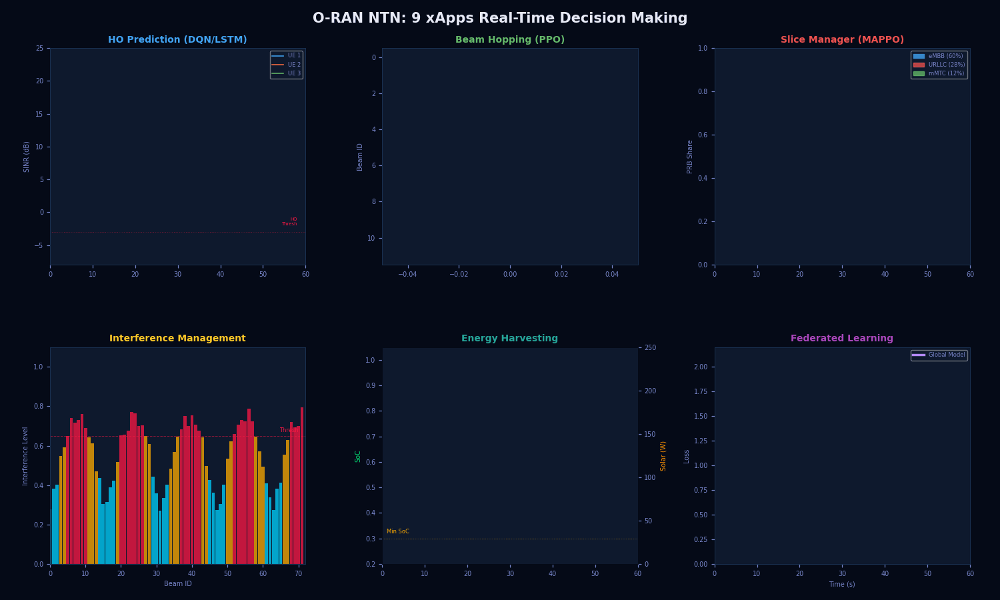
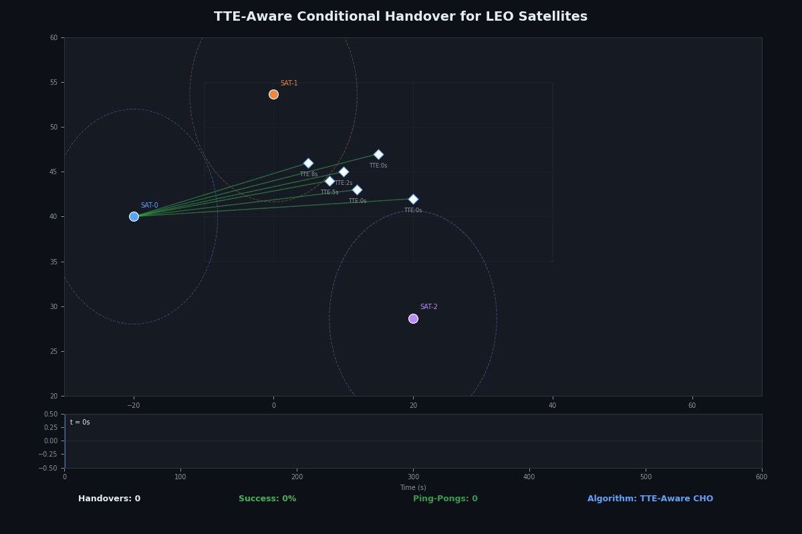
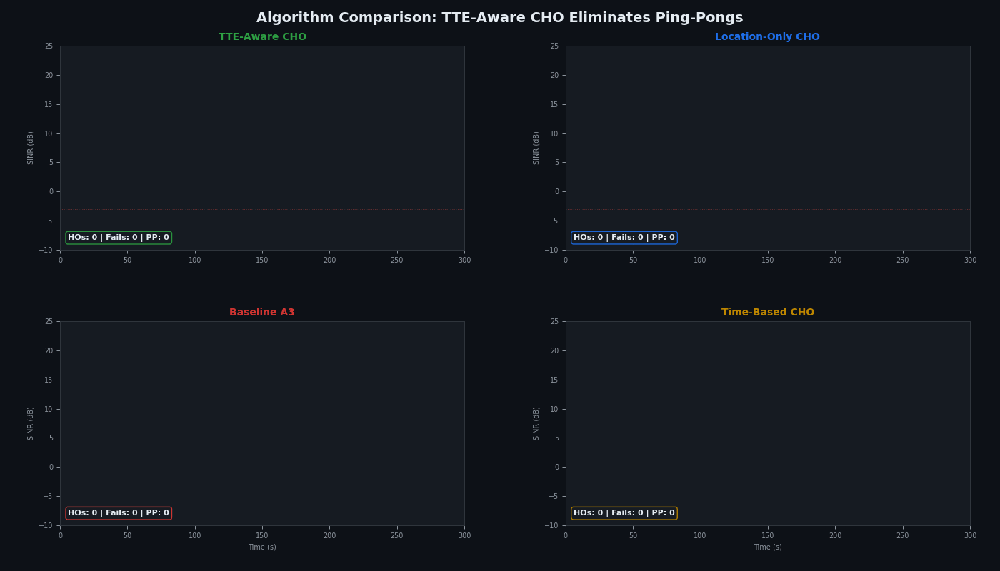
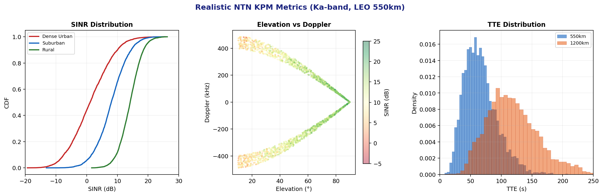

# NS3-NTN-Toolkit

**An Integrated NS-3.43 Simulation Platform for 6G Non-Terrestrial Networks**

[](https://www.nsnam.org)
[](https://www.gnu.org/licenses/old-licenses/gpl-2.0.en.html)
[]()

<p align="center">
  
</p>

---

## What is NS3-NTN-Toolkit?

A **ready-to-use** ns-3.43 simulation platform for 6G Non-Terrestrial Network (NTN) research. Clone, build, run -- no manual module patching required.

This toolkit integrates five major modules into a single pre-configured package:

| Module | Location | Capabilities |
|--------|----------|-------------|
| **mmWave (5G-NR)** | `contrib/mmwave/` | NR PHY/MAC (numerology 2/3), EESM error models, SVD/DFT/Codebook beamforming, HARQ, carrier aggregation, LTE-NR dual connectivity via McUeNetDevice |
| **SNS3 Satellite** | `contrib/satellite/` | SGP4 orbit propagation, 72 spot beams/sat, ISL routing, DVB-RCS2, mega-constellation support (Starlink 1584-sat, Kuiper 1156-sat, Iridium 66-sat with real TLE data) |
| **3GPP NTN Channel** | `src/propagation/` | TR 38.811 path loss and channel condition models for Dense Urban, Urban, Suburban, and Rural NTN scenarios |
| **O-RAN NTN** | `contrib/oran-ntn/` | Complete Space-O-RAN architecture: Near-RT/Non-RT/Space RIC, 9 xApps, OpenGymEnv RL training, federated learning, NTN beamforming, dual connectivity, ISL coordination (27,000+ LOC) |
| **THz-NTN (6G sub-THz)** | `contrib/thz-ntn/` | Terahertz communications (100 GHz - 10 THz): HITRAN molecular absorption, ITU-R weather/scintillation, UM-MIMO (up to 128x128), EKF beam tracking, THz inter-satellite links, Reconfigurable Intelligent Surfaces, ISAC for space debris, 5 waveforms (OFDM/OTFS/AFDM/DFT-s-OFDM/SC-FDE), 4 O-RAN THz xApps. Extends `SatFreeSpaceLoss`, uses `MmWaveAmc` and `SpectrumValue` for real SINR. 24 classes, 59 source files, 12 passing tests |

### Live Simulation Demos

**O-RAN NTN — 66-Satellite Constellation** with Space RICs, ISL links, feeder links, and UE connections:
<p align="center">
  
</p>

**O-RAN NTN — 9 xApps Dashboard** running concurrently (HO prediction, beam hopping, slicing, interference, energy, FL):
<p align="center">
  
</p>

**NTN-CHO — TTE-Aware Handover** with satellite ground tracks, TTE countdown, and handover events:
<p align="center">
  
</p>

**NTN-CHO — 4-Algorithm Comparison** (TTE-Aware vs Location vs A3 vs Time-Based):
<p align="center">
  
</p>

### Module Outputs & Results

**O-RAN NTN** — xApp outputs (SINR traces, beam heatmap, slice allocation, energy, FL convergence, interference):
<p align="center">
  
</p>

**NTN-CHO** — Algorithm comparison results (245 HOs, 0% ping-pong for TTE-Aware):
<p align="center">
  
</p>

**NTN KPM Metrics** — SINR CDFs, elevation vs Doppler, TTE distributions:
<p align="center">
  
</p>

### Key Integration: Patched LTE Module

The LTE module (`src/lte/`) is patched with dual-connectivity extensions enabling seamless LTE-NR-Satellite interworking:

- X2 PDCP/RLC providers for multi-connectivity (`EpcX2PdcpProvider`, `EpcX2RlcProvider`)
- RRC connection switching (`RrcConnectionSwitch`)
- Inter-RAT handover support between LTE and mmWave
- `MmWaveComponentCarrierConf` for mmWave carrier configuration
- `McEnbPdcp` / `McUePdcp` for multi-connectivity PDCP
- `LteRlcUmLowLat` for low-latency RLC

---

## Quick Start

```bash
# Step 1: Clone the toolkit
git clone https://github.com/Muhammaduazir69/ns3-ntn-toolkit.git
cd ns3-ntn-toolkit

# Step 2: Clone the SNS3 Satellite module (REQUIRED - not bundled due to 3.7 GB size)
cd contrib/
git clone https://github.com/sns3/sns3-satellite.git satellite
cd ..

# Step 3: Configure and build
./ns3 configure --enable-examples --enable-tests
./ns3 build

# Step 4: Verify all modules are available
./ns3 show profile   # Should list: mmwave, satellite, lte, ...

# Run mmWave example
./ns3 run mmwave-simple-epc

# Run dual-connectivity example (LTE + mmWave)
./ns3 run mc-twoenbs
```

> **Note**: The SNS3 satellite module is **required** for NTN simulation. It is not bundled in this repository due to its size (3.7 GB with constellation TLE data). You must clone it into `contrib/satellite/` as shown above before building.

## Adding the NTN-CHO Research Module

The [NTN-CHO Framework](https://github.com/Muhammaduazir69/ntn-cho-framework) is our research contribution for TTE-aware Conditional Handover. It requires the satellite module to be installed first:

```bash
cd contrib/
git clone https://github.com/Muhammaduazir69/ntn-cho-framework.git ntn-cho
cd ..
./ns3 configure --enable-examples
./ns3 build ntn-cho

# Run the full constellation handover simulation
./ns3 run "ntn-cho-full-constellation --algorithm=tte-aware --simTime=600 --numUes=50"
```

## Adding the THz-NTN Extension Module

The [ns3-thz-ntn](https://github.com/Muhammaduazir69/ns3-thz-ntn) module extends the toolkit with Terahertz (100 GHz - 10 THz) capabilities for 6G sub-THz satellite communications. It integrates deeply with the satellite and mmWave modules (extends `SatFreeSpaceLoss`, uses `MmWaveAmc` for MCS selection, `SpectrumValue` for real SINR computation):

```bash
cd contrib/
git clone https://github.com/Muhammaduazir69/ns3-thz-ntn.git thz-ntn
cd ..
./ns3 configure --enable-modules=thz-ntn
./ns3 build thz-ntn

# Run the test suite (12 tests, all passing)
./ns3 run "test-runner --suite=thz-ntn --verbose"

# Run the comprehensive demo with 8 scenarios and CSV dataset generation
cp contrib/thz-ntn/examples/thz-ntn-demo.cc scratch/
./ns3 build scratch/thz-ntn-demo
./build/scratch/ns3.43-thz-ntn-demo-debug            # All 8 scenarios
./build/scratch/ns3.43-thz-ntn-demo-debug --example=1 # Just scenario 1
```

**Capabilities**: HITRAN molecular absorption, ITU-R weather/scintillation, UM-MIMO arrays (up to 128x128), hierarchical beam tracking with EKF, THz inter-satellite links, Reconfigurable Intelligent Surfaces, ISAC for space debris detection, 5 waveforms (OFDM/DFT-s-OFDM/OTFS/AFDM/SC-FDE), 4 O-RAN THz xApps, NTN-CHO THz trigger extension. 24 model classes, 59 source files, 12 passing tests.

## Included Example: NTN-TN Integrated Analysis

The toolkit includes a comprehensive example at `scratch/ntn-tn-integrated-analysis.cc` that demonstrates genuine multi-module integration. This is a ready-to-use simulation for 6G NTN-TN handover research.

```bash
# Run the integrated analysis
./ns3 run "ntn-tn-integrated-analysis --algorithm=tte-aware --simTime=10 --numTnUes=4"
```

### What the Example Does

**Terrestrial Network (mmWave module - real packet-level simulation):**
- Creates real NR gNBs using `MmWaveHelper::InstallEnbDevice()` with actual PHY/MAC/RRC/HARQ stack
- Creates real EPC core network using `MmWavePointToPointEpcHelper` (SGW/PGW/MME with S1-U/S1-AP interfaces)
- Installs real UDP traffic flow: RemoteHost -> PGW -> S1-U tunnel -> gNB PHY -> wireless channel -> UE
- Uses `ThreeGppUmaPropagationLossModel` + `ThreeGppSpectrumPropagationLossModel` for terrestrial channel
- Real `MmWaveSvdBeamforming` with 8x8 UPA at gNB, 2x2 UPA at UE
- Real `MmWaveFlexTtiMacScheduler` for OFDMA resource scheduling
- Real HARQ retransmissions with configurable enable/disable
- Collects real PHY-layer SINR, MCS, transport block size, BLER per packet via `EnableTraces()`

**NTN Constellation (satellite module + 3GPP NTN models):**
- 66-satellite Walker Star constellation (6 planes x 11 sats, 780 km, 86.4 deg inclination)
- Uses `GeoCoordinate` from satellite module for proper geodetic/ECEF coordinate math
- Uses `ThreeGppNTN{DenseUrban,Urban,Suburban,Rural}PropagationLossModel` from ns-3 core for NTN channel
- Uses `ThreeGppNTN*ChannelConditionModel` for elevation-dependent LoS probability
- Keplerian orbital mechanics with proper RAAN, mean anomaly, Earth rotation
- Per-satellite Doppler shift computation from orbital velocity (~6.6 km/s)

**Handover Engine (ntn-cho module):**
- Uses real `NtnChoAlgorithm` class with 3GPP TS 38.331 CHO state machine
- Uses real `NtnChoHelper` for per-UE algorithm instantiation
- Uses real `NtnMeasurementModel` configured with NTN scenario parameters
- Per-UE NTN serving satellite tracking with handover decision logic
- TTE (Time-to-Exit) computation for each candidate satellite beam
- Compares 4 algorithms: TTE-aware CHO, Location-only CHO, Baseline A3, Time-based

### Output Files

The example generates the following datasets:

| File | Source | Description |
|------|--------|-------------|
| `mmwave_dl_sinr_trace.csv` | mmWave spectrum PHY | Real PHY-layer SINR, MCS, TB size, HARQ RV per received packet |
| `ntn_measurements.csv` | NTN-CHO measurement model | Per-UE per-satellite elevation, range, delay, Doppler, SINR, RSRP, path loss |
| `ntn_handover_events.csv` | NTN-CHO algorithm | NTN-NTN handover events with source/target, SINR, TTE, success/failure |
| `tte_computations.csv` | NTN-CHO TTE estimator | TTE prediction per candidate with gain, admitted status, elevation |
| `satellite_tracks.csv` | Walker Star model + GeoCoordinate | 66-satellite orbital positions (lat/lon/alt/velocity/period) |
| `cho_state_log.csv` | NtnChoAlgorithm | CHO state machine: candidates, admitted, best TTE, serving cell tracking |
| `kpi_summary.txt` | Combined | Aggregated KPIs for both TN and NTN |
| `DlPhyTransmissionTrace.txt` | mmWave EnableTraces() | Raw DL PHY transmission events (frame/subframe/slot/RNTI) |
| `RxPacketTrace.txt` | mmWave EnableTraces() | Raw received packet trace with SINR/MCS/corrupt/BLER |
| `UlPhyTransmissionTrace.txt` | mmWave EnableTraces() | Raw UL PHY transmission events |
| `EnbSchedAllocTraces.txt` | mmWave EnableTraces() | Real OFDMA scheduler resource allocation |

### Configurable Parameters

```bash
./ns3 run "ntn-tn-integrated-analysis \
  --simTime=60 \              # Simulation duration (seconds)
  --numTnUes=4 \              # Number of terrestrial UEs with real packet flow
  --numTnGnbs=2 \             # Number of mmWave gNBs
  --algorithm=tte-aware \     # CHO algorithm: tte-aware, location, a3, time
  --scenario=suburban \       # NTN scenario: dense-urban, urban, suburban, rural
  --harqEnabled=true \        # Enable/disable HARQ
  --interPacketInterval=500 \ # UDP packet interval (microseconds)
  --rngRun=1 \                # Random seed for reproducibility
  --outputDir=output/"        # Output directory
```

---

## Module Structure

```
ns3-ntn-toolkit/
├── src/
│   ├── lte/              # Patched LTE with dual-connectivity extensions
│   ├── propagation/      # 3GPP NTN propagation models (TR 38.811)
│   ├── spectrum/         # NTN channel example
│   ├── mobility/         # GeocentricConstantPositionMobilityModel
│   └── ...               # All standard ns-3.43 modules
├── contrib/
│   ├── mmwave/           # 5G-NR mmWave module (16 examples, all build)
│   ├── satellite/        # SNS3 satellite module (clone separately)
│   ├── ai/               # ns3-ai module for AI/ML integration (clone separately)
│   ├── oran-ntn/         # Space-O-RAN module: RICs, 9 xApps, FL, ISL coordination (clone separately)
│   ├── ntn-cho/          # TTE-aware Conditional Handover framework (clone separately)
│   ├── thz-ntn/          # THz (100 GHz - 10 THz) extension: HITRAN absorption,
│   │                     #   UM-MIMO, beam tracking, ISL, RIS, ISAC, 5 waveforms,
│   │                     #   O-RAN THz xApps (clone separately)
│   ├── magister-stats/   # Satellite statistics helpers
│   └── traffic/          # Traffic generation helpers
├── scratch/
│   └── ntn-tn-integrated-analysis.cc  # Multi-module NTN-TN example
└── ...
```

### Research modules (external, add via `git clone`)

| Module | Repository | Role |
|---|---|---|
| [ntn-cho-framework](https://github.com/Muhammaduazir69/ntn-cho-framework) | `contrib/ntn-cho/` | TTE-aware CHO algorithm (3GPP Rel-17), zero ping-pong, binary-search beam exit prediction |
| [oran-ntn](https://github.com/Muhammaduazir69/oran-ntn) | `contrib/oran-ntn/` | Space-O-RAN architecture: Near-RT/Non-RT/Space RIC, 9 xApps, Gymnasium RL, FL, ISL |
| [ns3-thz-ntn](https://github.com/Muhammaduazir69/ns3-thz-ntn) | `contrib/thz-ntn/` | 6G sub-THz extension: 24 model classes, HITRAN molecular absorption, UM-MIMO, RIS, ISAC, 5 waveforms, deep satellite/mmWave integration |
| [ns3-ai](https://github.com/Muhammaduazir69/ns3-ai) | `contrib/ai/` | Modernized ns3-ai fork for ns-3.43+ with LTO/pybind11 fixes, NumPy 2.0+, Gymnasium 1.0+ |

## Key Features & Contributions

### 1. Seamless Module Integration
The primary contribution of this toolkit is making mmWave, satellite, and NTN-CHO modules work together on ns-3.43 without conflicts. The patched LTE module provides the glue layer enabling LTE-NR dual connectivity and inter-RAT handover.

### 2. Real Packet-Level NR Simulation
Unlike analytical or link-level tools, the mmWave module provides real ns-3 packet flow through the full NR protocol stack (PDCP -> RLC -> MAC -> PHY -> spectrum channel -> beamforming). Every packet is individually scheduled, transmitted, received, and optionally retransmitted via HARQ.

### 3. 3GPP-Compliant NTN Channel Models
The toolkit includes the full set of 3GPP TR 38.811 NTN propagation and channel condition models directly from ns-3.43, covering all four deployment scenarios (Dense Urban, Urban, Suburban, Rural) with elevation-dependent LoS probability.

### 4. LEO Constellation Support
Via the SNS3 satellite module, the toolkit supports real TLE-based orbit propagation (SGP4), mega-constellation scenarios (Starlink, Kuiper, Iridium, Telesat), ISL routing, 72 spot beams per satellite, and antenna gain pattern modeling.

### 5. AI/ML Integration via ns3-ai
The toolkit includes a [modernized ns3-ai module](https://github.com/Muhammaduazir69/ns3-ai) (forked and fixed for ns-3.43+) that enables real-time AI-driven network control via shared memory:

```bash
# Add ns3-ai (our fixed fork, works with default build profile)
cd contrib/
git clone https://github.com/Muhammaduazir69/ns3-ai.git ai
cd ..
./ns3 configure --enable-examples
./ns3 build ai
pip install -e contrib/ai/python_utils
pip install -e contrib/ai/model/gym-interface/py
```

Key fixes in our fork: LTO/pybind11 compatibility (all build profiles), shared memory RAII, NumPy 2.0+, Python 3.13+, modern atomic semaphores. See the [ns3-ai PR #137](https://github.com/hust-diangroup/ns3-ai/pull/137) for details.

The [NTN-CHO Framework](https://github.com/Muhammaduazir69/ntn-cho-framework) includes an `NtnAiInterface` class that bridges ns3-ai shared memory with the handover engine, enabling DQN/PPO/Federated Learning agents for AI-driven satellite handover.

### 6. O-RAN NTN Module (Space-O-RAN)

The toolkit includes the [O-RAN NTN module](https://github.com/Muhammaduazir69/oran-ntn) -- a complete Space-O-RAN architecture for intelligent LEO satellite network management:

```bash
# Add O-RAN NTN module
cd contrib/
git clone https://github.com/Muhammaduazir69/oran-ntn.git oran-ntn
cd .. && ./ns3 build
```

**27,000+ LOC** implementing:
- **Near-RT RIC, Non-RT RIC, Space RIC** with full E2/A1 interfaces
- **9 xApps**: HO prediction (DQN/LSTM), beam hopping (PPO), slice management (MAPPO), Doppler compensation, TN-NTN steering, interference management (graph coloring), energy harvesting (solar/battery), predictive allocation (LSTM), multi-connectivity (DC orchestration)
- **5 OpenGymEnv** subclasses for RL-based xApp training via ns3-ai
- **Federated learning** coordinator (FedAvg/FedProx/FedNova) across orbital planes
- **Deep satellite integration**: Markov fading, DVB-S2X ModCod selection, inter-beam interference, ISL topology
- **mmWave NTN PHY**: elevation-aware beamforming, composite channel model (ITU-R P.676/P.618/P.531), RTT-aware scheduler
- **Dual connectivity** manager for simultaneous TN + NTN bearers
- **Space RIC inference engine**: LibTorch / msg-interface IPC / rule-based fallback

### 7. Extensible Architecture
Researchers can add their own contrib modules (like [ntn-cho-framework](https://github.com/Muhammaduazir69/ntn-cho-framework) or [oran-ntn](https://github.com/Muhammaduazir69/oran-ntn)) into `contrib/` and immediately access all integrated modules.

## Supported Constellation Data

Pre-configured TLE data for real satellite constellations:

| Constellation | Satellites | Altitude | Inclination | Data Path |
|--------------|-----------|----------|-------------|-----------|
| Iridium NEXT | 66 | 780 km | 86.4 deg | `contrib/satellite/data/scenarios/constellation-iridium-next-66-sats/` |
| Starlink | 1,584 | 550 km | 53.0 deg | `contrib/satellite/data/scenarios/constellation-starlink-1584-sats/` |
| Kuiper | 1,156 | 630 km | 51.9 deg | `contrib/satellite/data/scenarios/constellation-kuiper-1156-sats/` |
| Telesat | 351 | 1,015 km | 98.98 deg | `contrib/satellite/data/scenarios/constellation-telesat-351-sats/` |
| Custom LEO | 2 | ISS orbit | 51.6 deg | `contrib/satellite/data/scenarios/constellation-leo-2-satellites/` |

## System Requirements

- **OS**: Ubuntu 22.04+ / Debian 12+ / Fedora 38+
- **Compiler**: GCC 11+ or Clang 14+
- **CMake**: 3.16+
- **Python**: 3.8+ (for ns3 tool)
- **RAM**: 4 GB minimum, 8 GB recommended for large constellations

## What Was Modified from Upstream ns-3.43

Only 3 minimal changes to integrate mmWave with ns-3.43:

1. **`src/lte/`**: Replaced with mmWave project's patched LTE module (adds dual-connectivity APIs)
2. **`src/lte/model/lte-spectrum-value-helper.h`**: Added `#include <map>` (missing in mmWave's version)
3. **`src/lte/test/lte-test-carrier-aggregation.h`**: Added `#include <map>` (ns-3.43 stricter includes)

All other ns-3.43 modules are **unmodified** from upstream.

## Credits & Upstream Sources

- **ns-3.43**: [nsnam/ns-3-dev](https://gitlab.com/nsnam/ns-3-dev) (GPL-2.0)
- **mmWave module**: [NYU Wireless / CTTC](https://github.com/nyuwireless-unipd/ns3-mmwave) (GPL-2.0)
- **SNS3 satellite module**: [SNS3/sns3-satellite](https://github.com/sns3/sns3-satellite) (GPL-2.0)
- **Integration & NTN patches**: Muhammad Uzair

## Citation

If you use this toolkit in your research, please cite:

```bibtex
@software{ns3_ntn_toolkit_2026,
  author = {Muhammad Uzair},
  title = {NS3-NTN-Toolkit: An Integrated NS-3.43 Platform for 6G Non-Terrestrial Network Simulation},
  year = {2026},
  url = {https://github.com/Muhammaduazir69/ns3-ntn-toolkit}
}
```

---

# Original NS-3 README

## License

This software is licensed under the terms of the GNU General Public License v2.0 only (GPL-2.0-only).
See the LICENSE file for more details.

## Table of Contents

* [Overview](#overview-an-open-source-project)
* [Building ns-3](#building-ns-3)
* [Testing ns-3](#testing-ns-3)
* [Running ns-3](#running-ns-3)
* [ns-3 Documentation](#ns-3-documentation)
* [Working with the Development Version of ns-3](#working-with-the-development-version-of-ns-3)
* [Contributing to ns-3](#contributing-to-ns-3)
* [Reporting Issues](#reporting-issues)
* [ns-3 App Store](#ns-3-app-store)

> **NOTE**: Much more substantial information about ns-3 can be found at
<https://www.nsnam.org>

## Overview: An Open Source Project

ns-3 is a free open source project aiming to build a discrete-event
network simulator targeted for simulation research and education.
This is a collaborative project; we hope that
the missing pieces of the models we have not yet implemented
will be contributed by the community in an open collaboration
process. If you would like to contribute to ns-3, please check
the [Contributing to ns-3](#contributing-to-ns-3) section below.

This README excerpts some details from a more extensive
tutorial that is maintained at:
<https://www.nsnam.org/documentation/latest/>

## Building ns-3

The code for the framework and the default models provided
by ns-3 is built as a set of libraries. User simulations
are expected to be written as simple programs that make
use of these ns-3 libraries.

To build the set of default libraries and the example
programs included in this package, you need to use the
`ns3` tool. This tool provides a Waf-like API to the
underlying CMake build manager.
Detailed information on how to use `ns3` is included in the
[quick start guide](doc/installation/source/quick-start.rst).

Before building ns-3, you must configure it.
This step allows the configuration of the build options,
such as whether to enable the examples, tests and more.

To configure ns-3 with examples and tests enabled,
run the following command on the ns-3 main directory:

```shell
./ns3 configure --enable-examples --enable-tests
```

Then, build ns-3 by running the following command:

```shell
./ns3 build
```

By default, the build artifacts will be stored in the `build/` directory.

### Supported Platforms

The current codebase is expected to build and run on the
set of platforms listed in the [release notes](RELEASE_NOTES.md)
file.

Other platforms may or may not work: we welcome patches to
improve the portability of the code to these other platforms.

## Testing ns-3

ns-3 contains test suites to validate the models and detect regressions.
To run the test suite, run the following command on the ns-3 main directory:

```shell
./test.py
```

More information about ns-3 tests is available in the
[test framework](doc/manual/source/test-framework.rst) section of the manual.

## Running ns-3

On recent Linux systems, once you have built ns-3 (with examples
enabled), it should be easy to run the sample programs with the
following command, such as:

```shell
./ns3 run simple-global-routing
```

That program should generate a `simple-global-routing.tr` text
trace file and a set of `simple-global-routing-xx-xx.pcap` binary
PCAP trace files, which can be read by `tcpdump -n -tt -r filename.pcap`.
The program source can be found in the `examples/routing` directory.

## Running ns-3 from Python

If you do not plan to modify ns-3 upstream modules, you can get
a pre-built version of the ns-3 python bindings. It is recommended
to create a python virtual environment to isolate different application
packages from system-wide packages (installable via the OS package managers).

```shell
python3 -m venv ns3env
source ./ns3env/bin/activate
pip install ns3
```

If you do not have `pip`, check their documents
on [how to install it](https://pip.pypa.io/en/stable/installation/).

After installing the `ns3` package, you can then create your simulation python script.
Below is a trivial demo script to get you started.

```python
from ns import ns

ns.LogComponentEnable("Simulator", ns.LOG_LEVEL_ALL)

ns.Simulator.Stop(ns.Seconds(10))
ns.Simulator.Run()
ns.Simulator.Destroy()
```

The simulation will take a while to start, while the bindings are loaded.
The script above will print the logging messages for the called commands.

Use `help(ns)` to check the prototypes for all functions defined in the
ns3 namespace. To get more useful results, query specific classes of
interest and their functions e.g., `help(ns.Simulator)`.

Smart pointers `Ptr<>` can be differentiated from objects by checking if
`__deref__` is listed in `dir(variable)`. To dereference the pointer,
use `variable.__deref__()`.

Most ns-3 simulations are written in C++ and the documentation is
oriented towards C++ users. The ns-3 tutorial programs (`first.cc`,
`second.cc`, etc.) have Python equivalents, if you are looking for
some initial guidance on how to use the Python API. The Python
API may not be as full-featured as the C++ API, and an API guide
for what C++ APIs are supported or not from Python do not currently exist.
The project is looking for additional Python maintainers to improve
the support for future Python users.

## ns-3 Documentation

Once you have verified that your build of ns-3 works by running
the `simple-global-routing` example as outlined in the [running ns-3](#running-ns-3)
section, it is quite likely that you will want to get started on reading
some ns-3 documentation.

All of that documentation should always be available from
the ns-3 website: <https://www.nsnam.org/documentation/>.

This documentation includes:

* a tutorial
* a reference manual
* models in the ns-3 model library
* a wiki for user-contributed tips: <https://www.nsnam.org/wiki/>
* API documentation generated using doxygen: this is
  a reference manual, most likely not very well suited
  as introductory text:
  <https://www.nsnam.org/doxygen/index.html>

## Working with the Development Version of ns-3

If you want to download and use the development version of ns-3, you
need to use the tool `git`. A quick and dirty cheat sheet is included
in the manual, but reading through the Git
tutorials found in the Internet is usually a good idea if you are not
familiar with it.

If you have successfully installed Git, you can get
a copy of the development version with the following command:

```shell
git clone https://gitlab.com/nsnam/ns-3-dev.git
```

However, we recommend to follow the GitLab guidelines for starters,
that includes creating a GitLab account, forking the ns-3-dev project
under the new account's name, and then cloning the forked repository.
You can find more information in the [manual](https://www.nsnam.org/docs/manual/html/working-with-git.html).

## Contributing to ns-3

The process of contributing to the ns-3 project varies with
the people involved, the amount of time they can invest
and the type of model they want to work on, but the current
process that the project tries to follow is described in the
[contributing code](https://www.nsnam.org/developers/contributing-code/)
website and in the [CONTRIBUTING.md](CONTRIBUTING.md) file.

## Reporting Issues

If you would like to report an issue, you can open a new issue in the
[GitLab issue tracker](https://gitlab.com/nsnam/ns-3-dev/-/issues).
Before creating a new issue, please check if the problem that you are facing
was already reported and contribute to the discussion, if necessary.

## ns-3 App Store

The official [ns-3 App Store](https://apps.nsnam.org/) is a centralized directory
listing third-party modules for ns-3 available on the Internet.

More information on how to submit an ns-3 module to the ns-3 App Store is available
in the [ns-3 App Store documentation](https://www.nsnam.org/docs/contributing/html/external.html).
