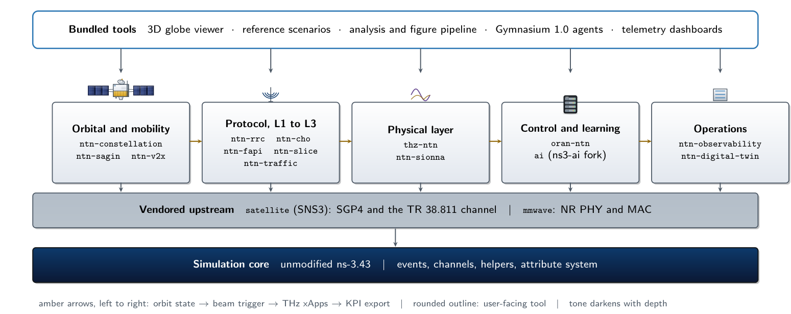

<p align="center">
  
</p>

<h1 align="center">ns3-ntn-toolkit</h1>

<p align="center">
  <strong>A pre-integrated ns-3.43 simulation platform for 6G non-terrestrial networks:
  LEO satellite constellations, 3GPP NR-NTN protocol stacks, O-RAN control loops,
  terahertz links and reinforcement-learning agents, in one tree that clones, builds and runs.</strong>
</p>

<p align="center">
  <a href="https://github.com/Muhammaduazir69/ns3-ntn-toolkit">GitHub</a>
  &nbsp;·&nbsp;
  <a href="https://gitlab.com/ns3-ntn-toolkit/ns3-ntn-toolkit">GitLab</a>
  &nbsp;·&nbsp;
  <a href="https://hub.docker.com/r/uzairdocker69/ns3-ntn-toolkit">Docker Hub</a>
  &nbsp;·&nbsp;
  <a href="INSTALL.md">Install guide</a>
  &nbsp;·&nbsp;
  <a href="SCOPE_AND_LIMITATIONS.md">What it does not model</a>
</p>

<p align="center">
  <a href="https://www.nsnam.org"></a>
  <a href="https://www.gnu.org/licenses/old-licenses/gpl-2.0.en.html"></a>
  
  
  
  
  
  
  
</p>

<p align="center">
  
</p>

<p align="center"><sub>Architecture as published in the accompanying manuscript. Amber arrows follow one run left to right: orbit state, beam trigger, THz xApps, KPI export.</sub></p>

---

## What this is

Simulating a 6G non-terrestrial network usually means assembling four unrelated
codebases and hoping their coordinate frames, time bases and units agree. An
orbital propagator that speaks TLEs. A cellular stack that speaks slots and RNTIs.
A channel model written for a terrestrial street canyon. A control framework that
expects a terrestrial gNB to be sitting still.

This toolkit is that assembly, done once and kept honest. It is a fork of
**ns-3.43** carrying **14 custom modules** and three vendored upstreams, wired so
that a satellite's SGP4 position drives a real NR spectrum PHY, a real handover
decision rides a real Xn interface with a real propagation delay, and every KPI a
scenario prints came off a packet that actually crossed the air interface.

The distinguishing property is not breadth. It is that the **decision plane and
the measurement plane are the same plane**. A handover trigger that fires moves a
terminal onto a different cell whose SINR is then measured, rather than
incrementing a counter beside an unrelated number.

**Who it is for.** Researchers working on LEO satellite communications, NR-NTN
mobility management, satellite O-RAN and RIC placement, sub-terahertz and
terahertz links, space-air-ground integrated networks, and reinforcement learning
for satellite radio resource management, who would rather spend their time on the
contribution than on the integration.

---

## Try it in 60 seconds

### Docker, no build required

The whole toolkit, prebuilt: ns-3.43, all 14 modules, the SNS3 `satellite` stack,
the mmWave and 5G-LENA `nr` NR stacks, the Python tooling and the digital-twin
server.

```bash
docker pull uzairdocker69/ns3-ntn-toolkit:latest

# A LEO conditional-handover pass with a real NR cell under SGP4 mobility
docker run --rm uzairdocker69/ns3-ntn-toolkit:latest \
  ./ns3 run "ntn-cho-real-stack --trigger=d2 --simSeconds=60"

# An interactive shell inside the built tree
docker run --rm -it uzairdocker69/ns3-ntn-toolkit:latest bash
```

### From source

```bash
git clone --branch ntn-integration-v2 \
  https://github.com/Muhammaduazir69/ns3-ntn-toolkit.git
cd ns3-ntn-toolkit
./ns3 configure --enable-examples --enable-tests
./ns3 build
./ns3 run ntn-real-stack-smoke
```

Full prerequisites, the SNS3 `satellite` dependency, GPU setup for Sionna RT and
the troubleshooting table are in **[INSTALL.md](INSTALL.md)**.

---

## The 14 modules

Each module is also published as a standalone repository on GitHub and GitLab, so
it can be dropped into an existing ns-3 tree on its own.

### Orbital and mobility

| Module | What it gives you |
|---|---|
| **[`ntn-constellation`](contrib/ntn-constellation)** | SGP4 and Walker-Delta constellation generation from TLEs or orbital elements, contact-graph routing and scheduling across inter-satellite links, limb-clearance geometry, and shipped presets for Starlink-class, OneWeb-class and Iridium-class shells. Calibrated against the TR 38.821 free-space corpus. |
| **[`ntn-sagin`](contrib/ntn-sagin)** | Space-air-ground integrated networking: ground, UAV, HAPS and LEO layers with a multi-layer router, TR 36.777 air-to-ground propagation with a declared validated-height boundary, and store-and-forward across contact gaps. |
| **[`ntn-v2x`](contrib/ntn-v2x)** | Satellite-assisted vehicle-to-everything: NR sidelink PC5 Mode 2, SAE J2735 basic safety messages encoded the way the standard encodes them, SUMO trace ingestion, and a runtime transmit gate so a relay decision can actually gate a flow. |

### Protocol, L1 to L3

| Module | What it gives you |
|---|---|
| **[`ntn-traffic`](contrib/ntn-traffic)** | `NtnRealStackHelper`, the dual-backend spine every other module builds on. Assembles a real mmWave or 5G-LENA `nr` cell (SpectrumPhy, LDPC error model, HARQ, RLC, PDCP, RRC, EPC, GTP) under satellite mobility, with TR 38.811 excess loss, per-BWP loss chaining, NTN-stretched timers and an in-band application header that makes delay, jitter and loss measurable rather than derived. |
| **[`ntn-cho`](contrib/ntn-cho)** | Conditional handover for LEO. Time-to-exit estimation from real two-body propagation, and the standardized NTN trigger set: TS 38.331 CondEvent A3, D1, T1 on its absolute epoch, Rel-18 D2 on a moving ephemeris reference, plus the TR 38.821-studied elevation and timing-advance mechanisms. |
| **[`ntn-rrc`](contrib/ntn-rrc)** | NR-NTN radio resource control: SIB19 broadcast with `cellSpecificKoffset` consumed by the scheduler rather than merely published, timing advance that differs between transparent and regenerative payloads because the feeder leg is in the geometry, and DRX that gates a real flow. |
| **[`ntn-fapi`](contrib/ntn-fapi)** | An SCF-222 FAPI MAC-PHY adapter that decorates a live NR SAP, with per-UE HARQ state and a latency gate anchored to the geometric floor of the link it runs on. |
| **[`ntn-slice`](contrib/ntn-slice)** | Network slicing over NTN: eMBB, URLLC and mMTC slices with per-5QI and per-S-NSSAI dedicated bearers, TFT filters, and SLA percentiles taken from a delay histogram rather than from a mean. |

### Physical layer

| Module | What it gives you |
|---|---|
| **[`thz-ntn`](contrib/thz-ntn)** | Sub-terahertz and terahertz NTN links from 100 GHz to 1 THz: ITU-R P.676-13 molecular absorption over a layered atmosphere, P.838-3 rain, P.840 fog, P.618-13 tropospheric scintillation with the correct elevation exponent, Tatarskii turbulence, pointing error, and reconfigurable intelligent surfaces. |
| **[`ntn-sionna`](contrib/ntn-sionna)** | A bridge to NVIDIA Sionna RT for GPU ray tracing, with a channel impulse response propagation model, a calibrator against the closed-form TR 38.811 reference, and provenance on every query so a run says whether it was ray traced or fell back. |

### Control and learning

| Module | What it gives you |
|---|---|
| **[`oran-ntn`](contrib/oran-ntn)** | Space O-RAN: E2AP termination, E2SM-KPM under TS 28.552 measurement names, E2SM-RC control actions that actuate a real handover, A1 policy distribution, a multi-tier RIC (on-board real-time, gateway, cloud) whose E2 latency comes from live slant geometry, transparent and Rel-19 regenerative payload options, a WG3 conflict-mitigation taxonomy, and a FlexRIC bridge. |
| **[`ns3-ai-ntn`](contrib/ns3-ai-ntn)** | A fork of ns3-ai carrying a Gymnasium 1.0 environment set for NTN: handover selection, beam management, slice admission and power control, with a versioned shared-memory contract so the C++ and Python sides cannot silently disagree. |

### Operations

| Module | What it gives you |
|---|---|
| **[`ntn-observability`](contrib/ntn-observability)** | One scene recorder feeding NetSimulyzer, CZML for Cesium globes, InfluxDB line protocol and Grafana dashboards, with links and topology exported alongside positions, and a documented simulation-time anchor. |
| **[`ntn-digital-twin`](contrib/ntn-digital-twin)** | A FastAPI digital twin that predicts handovers from live ephemeris and actuates them back into a running simulation, sharing one A3 guard implementation with the exporter so prediction and actuation cannot drift apart. |

---

## Measured results

Two campaigns shipped with the tree, both reproducible from the committed CSVs
under `papers/sim_runs/`.

**Conditional handover over a LEO shell.** Ten seeds, a 780 km Walker shell at
86.4 degrees inclination, four algorithms on the same geometry and the same
traffic. The comparison is not about who hands over most successfully; it is
about how much churn each one buys that success with.

| Algorithm | Handovers per run | Success | Ping-pong |
|---|---:|---:|---:|
| A3 RSRP (baseline) | 463.3 ± 66.8 | 69.16% | 50.23% |
| Time-based | 361.7 ± 42.4 | 63.14% | 0.00% |
| Location-based | 199.5 ± 56.0 | 98.69% | 57.07% |
| **TTE-aware** | **134.6 ± 16.3** | **83.14%** | **0.00%** |

Location-based wins on success rate and pays for it: it hands over on geometry
alone, so more than half of its handovers come straight back. TTE-aware reaches
83% success on a third of the A3 baseline's handover count with no ping-pong at
all, because the decision is conditioned on how long the target will still be
serviceable rather than on how good it looks right now. The intervals are 95%
confidence over the ten seeds.

**O-RAN xApp routing.** One multi-xApp configuration, five active xApps: 7,738
near-real-time decisions producing **71,967** successful actions, with the E2
control loop measured end to end rather than per component. The two counts differ
by an order of magnitude because one decision fans out to many actuations, and
Doppler compensation dominates: 4,272 of the decisions, 68,489 of the actions.
Reporting only the larger number would flatter the decision engine, so the
metrics file carries both, per xApp.

---

## What makes the numbers trustworthy

Simulation platforms are easy to overclaim and hard to check. Three mechanisms in
this tree exist specifically to make the claims checkable by someone who did not
write them.

**Provenance on every metric.** The health record each scenario writes
(`sim_health.csv`) labels every row with how its value was obtained: measured
in band, modeled from a closed form, or configured. A number that came from an
equation cannot be printed as if it came from a packet.

**Gates that can fail.** `tools/check_ntn_standards.py` runs 16 gates covering the
TR 38.821 Set-1 link budget, orbital geometry, the published latency bands and all
five NTN handover trigger classes. `tools/check_doc_claims.py` fails the build when
a README makes a capability claim the code contradicts, or quotes a number the
committed data does not carry. `tools/check_dashboard_producers.py` walks each
dashboard panel back through the metric schema to the code that emits it.

**A stated boundary.** [SCOPE_AND_LIMITATIONS.md](SCOPE_AND_LIMITATIONS.md) is the
authoritative list of what the toolkit does not model, written so that a reviewer
can rely on an explicit scope rather than an inferred one. Among other things: the
absence of Rel-19 AI/ML lifecycle management, the multi-tap NTN-TDL that is not
implemented, and where propagation delay rides the transport leg rather than the
air interface.

---

## Reproducing a result

Every shipped scenario writes a CSV and a health record to `--outputDir`.

```bash
# 1. A TR 38.821 Set-1 LEO-600 link-budget calibration
./ns3 run "ntn-tr38821-calibration --outputDir=out/"

# 2. The full standards gate set
python3 tools/check_ntn_standards.py

# 3. All 23 module test suites
./test.py -s ntn-cho -s oran-ntn -s thz-ntn -s ntn-constellation
```

The Docker image is the reproducible path, because the SNS3 `satellite` tree is a
compile-time dependency that this repository does not vendor. See
[INSTALL.md](INSTALL.md) for how to obtain it for a source build.

---

## Documentation

| Where | What is there |
|---|---|
| **[Documentation site](https://muhammaduazir69.github.io/ns3-ntn-toolkit/)** | Getting started, architecture, per-module pages, papers, citation |
| **[INSTALL.md](INSTALL.md)** | Prerequisites, source build, Docker, GPU setup, troubleshooting |
| **[SCOPE_AND_LIMITATIONS.md](SCOPE_AND_LIMITATIONS.md)** | Architectural boundaries, stated explicitly |
| **[CHANGELOG.md](CHANGELOG.md)** | Release history for the toolkit and each module |
| **[CONTRIBUTING.md](CONTRIBUTING.md)** | How to add a module or a scenario |
| `contrib/<module>/README.md` | Per-module reference, examples and install notes |

---

## Standards and references implemented

**3GPP.** TR 38.811 (NTN channel model, aperture, shadow-fading sigma tables,
Rician K-factor, NTN-TDL), TR 38.821 (NTN solutions, Set-1 LEO-600 and GEO
reference parameters, handover interruption budget), TS 38.101-5 (NTN FR1 bands
n255 and n256, channel bandwidths), TS 38.133, TS 38.211, TS 38.213 (K_offset,
timing advance), TS 38.214 (CQI and MCS tables), TS 38.300, TS 38.321, TS 38.331
(SIB19, CondEvent A3/A4/D1/D2/T1, conditional reconfiguration), TS 38.413,
TS 38.423 (Xn), TS 38.885 (V2X sidelink), TS 28.552 (performance measurements),
TR 36.777 (aerial vehicles), TR 37.885, TR 38.901.

**ITU-R.** P.676-13 (gaseous attenuation), P.618-13 (Earth-space propagation),
P.838-3 (rain), P.840 (cloud and fog), P.681-11 (land mobile satellite),
P.835-6 (reference atmospheres).

**O-RAN Alliance.** E2AP, E2SM-KPM, E2SM-RC, A1 policy, WG2 and WG3 architecture,
non-real-time and near-real-time RIC.

**Others.** ETSI EN 302 307-1 (DVB-S2 MODCOD), SAE J2735 (basic safety message),
Small Cell Forum FAPI 222.10.02.

---

## Keywords

6G, non-terrestrial network, NTN simulator, ns-3, ns-3.43, LEO satellite
constellation, satellite communication, satellite network simulation, 3GPP
Release 17, Release 18, Release 19, NR-NTN, 5G NR, 5G-LENA, mmWave, SGP4,
Walker-Delta, two-line element, orbital propagation, conditional handover, CHO,
time-to-exit, TTE, handover trigger, CondEventD2, SIB19, K_offset, timing advance,
Doppler, inter-satellite link, ISL, feeder link, regenerative payload, transparent
payload, on-board processing, link budget, EIRP, beam hopping, O-RAN, RAN
intelligent controller, RIC, xApp, rApp, E2 interface, E2SM-KPM, E2SM-RC, A1
policy, FlexRIC, Space O-RAN, network slicing, 5QI, S-NSSAI, URLLC, eMBB, mMTC,
terahertz communication, THz, sub-THz, molecular absorption, ITU-R P.676,
atmospheric attenuation, rain attenuation, scintillation, reconfigurable
intelligent surface, RIS, Sionna RT, ray tracing, GPU channel modeling, digital
twin, network digital twin, reinforcement learning, deep reinforcement learning,
Gymnasium, ns3-ai, multi-agent reinforcement learning, radio resource management,
space-air-ground integrated network, SAGIN, HAPS, UAV communication, V2X,
vehicle-to-everything, NR sidelink, PC5, SAE J2735, SUMO, FAPI, Small Cell Forum,
NetSimulyzer, Cesium, InfluxDB, Grafana, reproducible research, open-source
simulator.

---

## Citing this work

If the toolkit contributes to a publication, please cite it. The current entry
lives in [CITATION.cff](CITATION.cff) and on the
[citation page](https://muhammaduazir69.github.io/ns3-ntn-toolkit/cite/).

---

## Author

**Muhammad Uzair**, Independent Researcher
[ORCID 0009-0002-4104-2680](https://orcid.org/0009-0002-4104-2680)
muhammaduzairr69@gmail.com

## License

GPL-2.0-only, matching ns-3. Vendored upstreams keep their own licenses: the SNS3
`satellite` module, the `mmwave` module, 5G-LENA `nr`, `netsimulyzer` and the
`ns3-ai` fork are each governed by the license in their own subtree.
