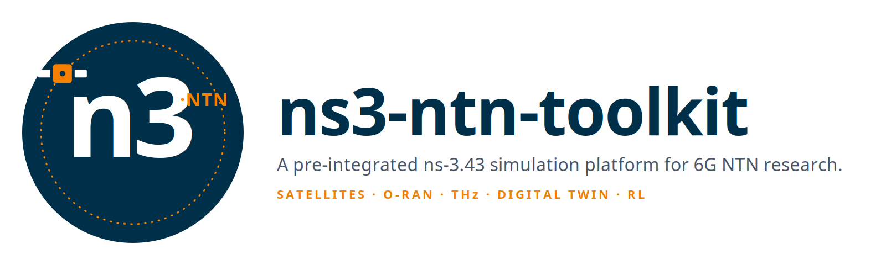
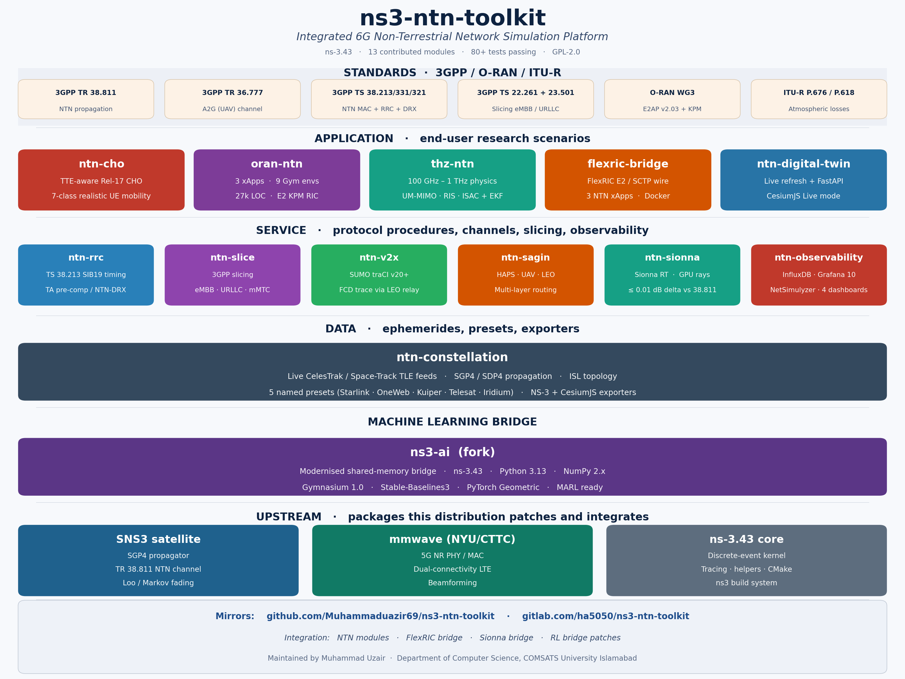
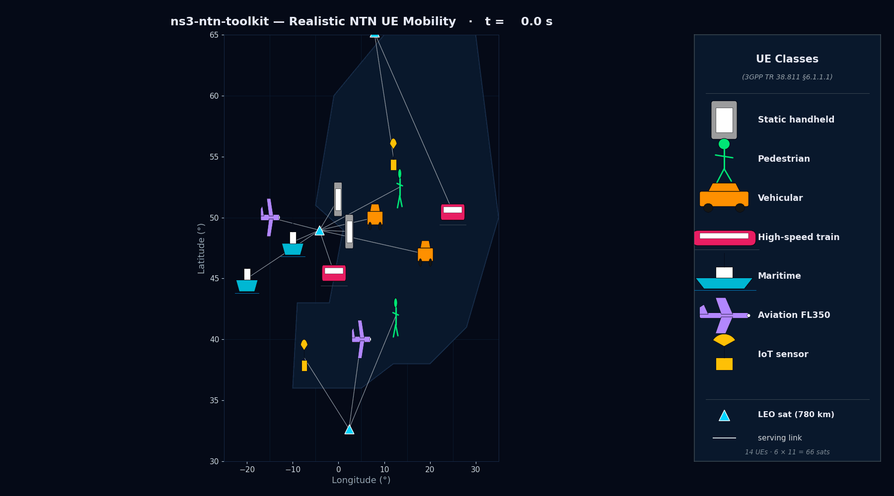
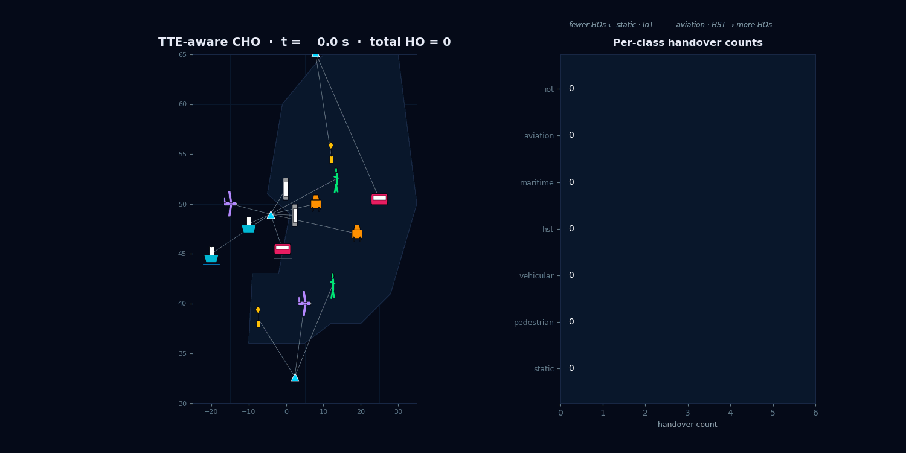
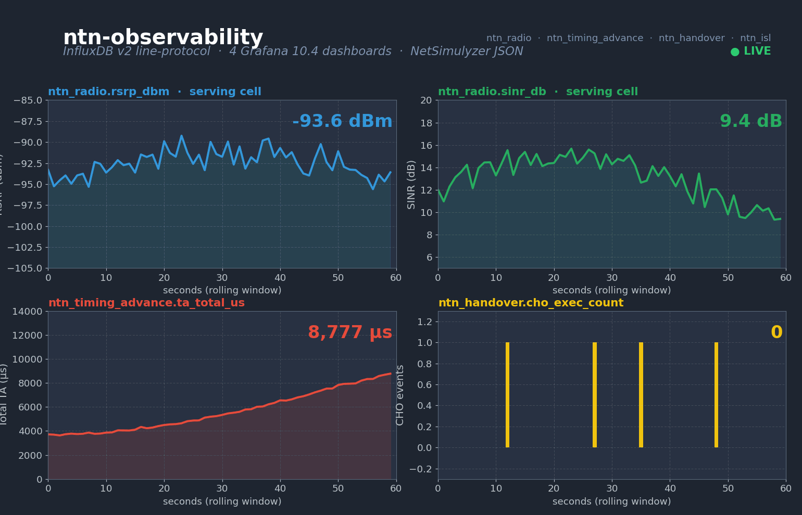
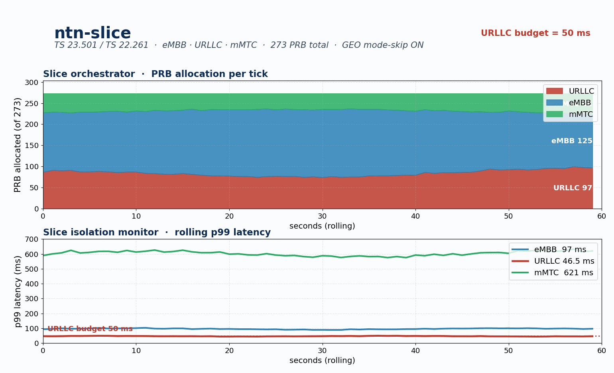
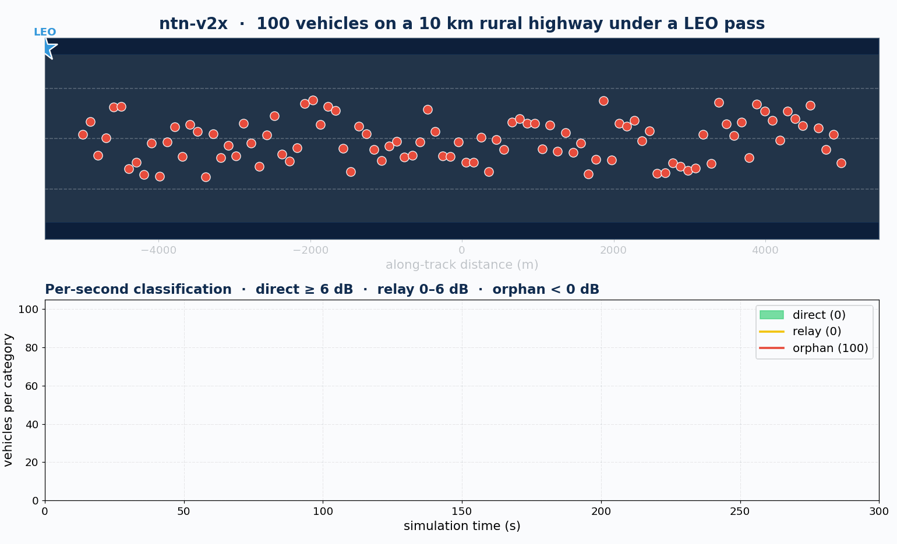
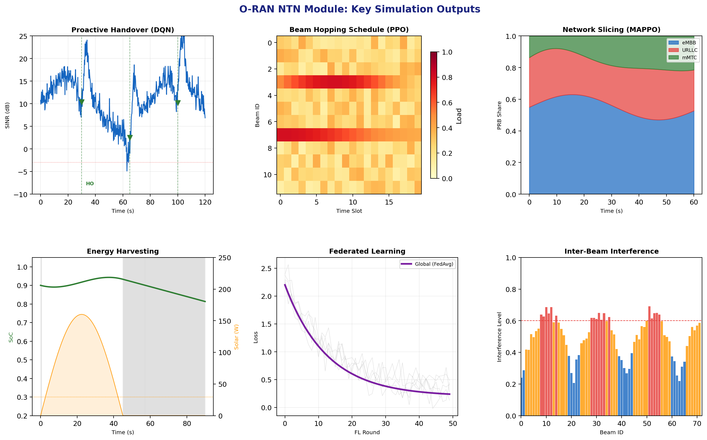
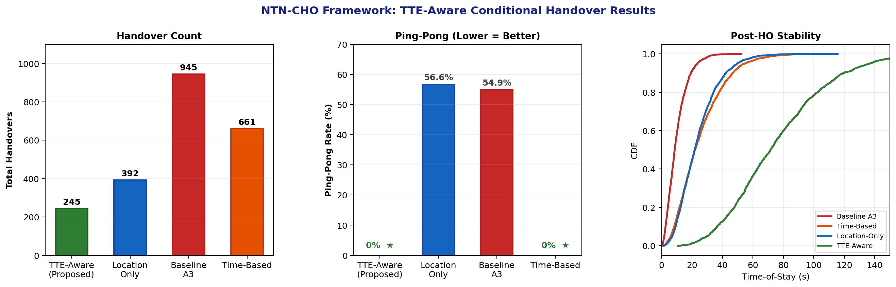
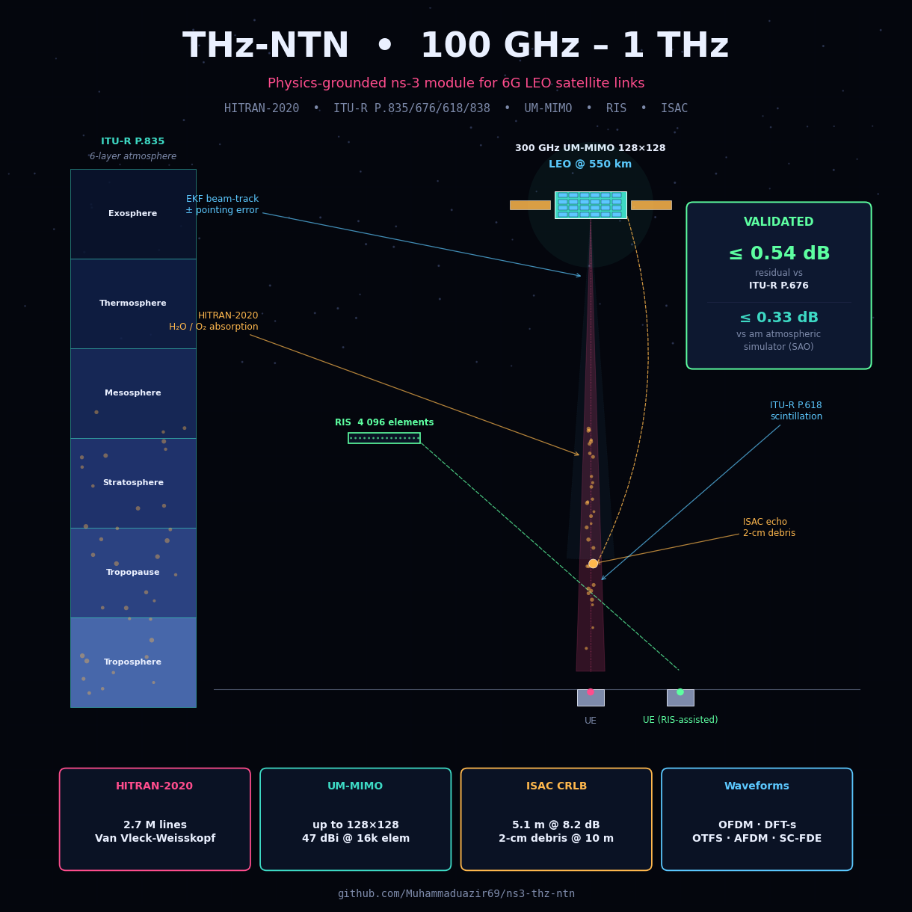

<p align="center">
  
</p>

<p align="center"><strong>A Pre-Integrated ns-3.43 Simulation Platform for 6G Non-Terrestrial Network Research — Clone, Build, Run.</strong></p>

<p align="center">
  <em>Mirrors:&nbsp;</em>
  <a href="https://github.com/Muhammaduazir69/ns3-ntn-toolkit">GitHub</a>
  &nbsp;·&nbsp;
  <a href="https://gitlab.com/ns3-ntn-toolkit/ns3-ntn-toolkit">GitLab</a>
</p>

<p align="center">
  <a href="https://www.nsnam.org"></a>
  <a href="https://www.gnu.org/licenses/old-licenses/gpl-2.0.en.html"></a>
  
  
  
  
  
  
</p>

<p align="center">
  <a href="https://hub.docker.com/r/uzairdocker69/ns3-ntn-toolkit"></a>
  <a href="https://hub.docker.com/r/uzairdocker69/ns3-ntn-toolkit"></a>
  <a href="https://pypi.org/project/ns3-ntn-toolkit/"></a>
  <a href="https://pypi.org/project/ntn-constellation/"></a>
  <a href="https://pypi.org/project/ntn-digital-twin/"></a>
  <a href="https://huggingface.co/spaces/Muhammaduazir69/ns3-ntn-toolkit-demo"></a>
  <a href="https://github.com/sponsors/Muhammaduazir69"></a>
</p>

<p align="center">
  
</p>

---

> **What's new in v2.1 (2026-06) — AI-Native ORAN-NTN.** Every example now
> runs on a **real mmWave NR NTN cell** (SpectrumPhy/MAC/RLC/PDCP/RRC/EPC)
> under SGP4 satellite mobility, and every KPI is **measured in-band**:
> a new NTN/O-RAN application layer (`NtnOranApplication` + 24-byte wire
> payload header carrying 5QI/S-NSSAI/seq/timestamp) replaces OnOff traffic
> toolkit-wide; an E2SM-KPM/TS 28.552 flow monitor (`NtnOranAiFlowMonitor`)
> feeds AI xApps; a multi-tier RIC (on-board RT / gateway / cloud) takes its
> E2 latency from live slant geometry; regenerative-payload options (a
> **Rel-19** architecture: gNB-on-board became normative in Release 19,
> Rel-17 is transparent-only), FH splits, platform latency classes and role
> switching are modelled per the AI-native Space-O-RAN literature; and a
> standards campaign calibrates the radio against **TR 38.821 Set-1
> LEO-600** and implements the NTN handover triggers: **Rel-17 CondEvents
> A4/T1/D1, Rel-18 CondEventD2 (moving ephemeris references), plus the
> TR 38.821-studied elevation and timing-advance mechanisms**. Gates: 36/36
> protocol-fidelity checks, 13/13 standards checks. See
> **[CHANGELOG.md](CHANGELOG.md)**.
>
> **v2 (2026-05).** End-to-end CSV output-realism audit across
> every example (signed LEO Doppler, 3GPP-bounded RSRQ, slant-range latency,
> Ka link budgets, TR 36.777 NLOS floor, orbital SGP4 RRC, on-board O-RAN
> autonomy) plus new cross-module examples that compose the contrib modules
> over a real ns-3 data plane. See **[CSV_REALISM_FIXES_2026-05.md](CSV_REALISM_FIXES_2026-05.md)**.

---

## Try it in 30 seconds

### 🐳 Docker (recommended — full toolkit, no build)

The entire toolkit — ns-3.43, all 15 bundled modules, SNS3 satellite, mmWave 5G NR,
Python utilities, FastAPI digital-twin server, NetSimulyzer + InfluxDB sinks —
is pre-built in a single image on Docker Hub:

```bash
docker pull uzairdocker69/ns3-ntn-toolkit:latest

# Run any of the shipped reference scenarios:
docker run --rm uzairdocker69/ns3-ntn-toolkit:latest \
  ./ns3 run "ntn-tn-integrated-analysis --algorithm=tte-aware --simTime=10 --numTnUes=4"

# Interactive shell + expose the digital-twin (8090) and Grafana (3000) ports:
docker run --rm -it -p 8090:8090 -p 3000:3000 \
  uzairdocker69/ns3-ntn-toolkit:latest bash

# Pin to a tagged release for reproducibility:
docker pull uzairdocker69/ns3-ntn-toolkit:2.1.0
```

The current release tag is `2.1.0` (~7.5 GB extracted; the pull is
network-bound). The Hub page at
<https://hub.docker.com/r/uzairdocker69/ns3-ntn-toolkit> has the full
description, tag list, and pull stats.

### 🤗 Live demo (browser only, zero install)

```bash
# Real Starlink/OneWeb/Iridium/GPS TLEs · Skyfield SGP4 +
# Earth-rotation-aware sub-satellite tracks · Plotly world map.
open https://huggingface.co/spaces/Muhammaduazir69/ns3-ntn-toolkit-demo
```

### 🐍 Python side (utilities only, pip-installable)

```bash
pip install ns3-ntn-toolkit   # metapackage — pulls ntn-constellation + ntn-digital-twin
ns3-ntn-toolkit info
ns3-ntn-toolkit modules
```

### 🛠️ From source (developers — full build, ~15 min)

```bash
git clone https://github.com/Muhammaduazir69/ns3-ntn-toolkit
cd ns3-ntn-toolkit
./ns3 configure --enable-examples --enable-tests --build-profile=optimized
./ns3 build -j$(nproc)
```

---

## Why this toolkit

Open research on 6G non-terrestrial networks is held back by **tool fragmentation**: orbit propagation, 3GPP NTN protocol procedures, 5G/NR PHY/MAC, Open-RAN E2/A1 wires, network slicing, V2X mobility, ray-traced channels, and reinforcement-learning bridges typically live in eight or nine packages that rarely build together on a recent ns-3 release. `ns3-ntn-toolkit` consolidates them into a single buildable distribution. A single `./ns3 build` yields an end-to-end NTN simulator in roughly fifteen minutes — turning what would be a multi-week integration effort into an hour-long onboarding task — and every contributed module ships with a numerical verification harness (closed-form ground truth, parameterised tests, long-run audits) so a reviewer can re-run and trust the published numbers.

## At a glance

| Capability | Numbers |
|---|---|
| ns-3 base | **3.43** (patched LTE for dual connectivity) |
| Custom modules contributed by this work | **15** (see *Bundled modules* below) |
| Combined unit + integration tests | **100+** across the bundled modules, all passing |
| Data plane | real mmWave NR NTN cell (SpectrumPhy/MAC/RLC/PDCP/RRC/EPC) under SGP4 mobility; all KPIs **measured in-band** |
| NTN/O-RAN application layer | `NtnOranApplication` 5QI profiles + 24-byte wire payload header (5QI / S-NSSAI / seq / timestamp) |
| KPM monitoring | `NtnOranAiFlowMonitor` — TS 28.552 / E2SM-KPM series, AI feature windows, anomaly events, CSV/XML/Influx/E2 export |
| 3GPP NTN procedures implemented | TS 38.213 TA + §4.2 K_offset (SIB19-populated **and** consumed into the NR UL DCI→PUSCH gap) · TS 38.331 SIB19 + UE Location Report · TS 38.321 NTN-DRX + §5.22 PC5 sidelink Mode-2 (V2X) · TR 36.777 A2G · NTN HO triggers: Rel-17 CondEvents A4/T1/D1 + Rel-18 D2 + TR 38.821-studied elevation/TA |
| Standards calibration | TR 38.821 Set-1 LEO-600 S-band link budget · orbital-theory test campaign · 36/36 fidelity + 15/15 standards gates |
| 3GPP slicing | TS 23.501 + TS 22.261 default profiles, eMBB / URLLC / mMTC / V2X (S-NSSAI carried in-band) |
| O-RAN xApps shipped | 16 (13 in `oran-ntn` + 3 NTN-aware in `flexric-bridge`) + ONNX Runtime xApp inference (optional) |
| O-RAN RIC tiers | on-board RT-RIC (<10 ms enforced) · gateway / cloud Near-RT placement with E2 latency from live slant geometry |
| O-RAN E2 wire | in-simulator E2AP/KPM/RC over a PER-style codec, plus a TCP/JSON stub for the same xApp logic; the live FlexRIC SCTP path is scaffolded and not demonstrated (see the W8 roadmap note below) |
| Regenerative payloads (Rel-19) | transparent (Rel-17 normative) / RU / RU+DU / full-gNB options · FH split model (Opt 2, 7.2a, 7.2b, 8) · role switching |
| Reinforcement-learning bridge | Gymnasium 1.0 over patched ns3-ai (Py 3.13 + NumPy 2 ready); SB3 PPO + PyG GAT |
| Channel models | TR 38.811 closed-form (default) · NVIDIA Sionna RT GPU ray-tracing (opt-in) |
| Vehicular | SUMO TraCI v20+ live + FCD-trace replay |
| Constellation feeds | live CelesTrak + Space-Track + 5 named presets (Starlink / OneWeb / Kuiper / Telesat / Iridium) |
| Observability | InfluxDB 2.7 (UDP + file) + Grafana 10.4 (4 dashboards) + NetSimulyzer 1.0 JSON |
| Live digital twin | FastAPI prediction API at p99 ≤ 30 ms; CesiumJS Live mode |

## Bundled modules

| # | Module | Repo | Purpose |
|---:|---|---|---|
| 1 | `ntn-constellation` | [ntn-constellation](https://github.com/Muhammaduazir69/ntn-constellation) | Live TLE feeds, SGP4/SDP4 propagation, ISL topology, SNS3 + CesiumJS exporters |
| 2 | `ntn-rrc` | [ntn-rrc](https://github.com/Muhammaduazir69/ntn-rrc) | TS 38.213 TA pre-comp, TS 38.331 SIB19 + UE Location Report, TS 38.321 NTN-DRX |
| 3 | `ntn-observability` | [ntn-observability](https://github.com/Muhammaduazir69/ntn-observability) | InfluxDB sinks, NetSimulyzer JSON, Grafana stack with 4 dashboards |
| 4 | `ns3-ai` (fork) | [ns3-ai](https://github.com/Muhammaduazir69/ns3-ai) | Modernised shared-memory bridge — ns-3.43 + Py 3.13 + NumPy 2 + Gymnasium 1.0 + SB3 + PyG |
| 5 | `ntn-sagin` | [ntn-sagin](https://github.com/Muhammaduazir69/ntn-sagin) | HAPS / UAV mobility + TR 36.777 A2G + multi-layer Ground→UAV→HAPS→LEO router |
| 6 | `ntn-slice` | [ntn-slice](https://github.com/Muhammaduazir69/ntn-slice) | TS 23.501 slicing (eMBB/URLLC/mMTC/V2X) + isolation monitor + GEO mode-skip |
| 7 | `ntn-v2x` | [ntn-v2x](https://github.com/Muhammaduazir69/ntn-v2x) | SUMO TraCI bridge + V2X-LEO direct/relay channels + maritime scenario + **NR PC5 sidelink Mode-2** (TS 38.321 §5.22 sensing-based selection, SAE J2735 BSM, TS 38.885 PRR) |
| 8 | `flexric-bridge` | [flexric-bridge](https://github.com/Muhammaduazir69/flexric-bridge) | FlexRIC E2 real-wire integration: NTN E2 agent + 3 xApps + Docker stack |
| 9 | `ntn-sionna` | [ntn-sionna](https://github.com/Muhammaduazir69/ntn-sionna) | NVIDIA Sionna RT bridge: GPU-accelerated ray-traced sat-to-ground channel |
| 10 | `ntn-digital-twin` | [ntn-digital-twin](https://github.com/Muhammaduazir69/ntn-digital-twin) | Live TLE refresher + FastAPI predict-handover + CesiumJS Live mode + handover-schedule export that an ns-3 C++ consumer actuates (closes the twin↔sim loop) |
| 11 | `ntn-cho` | [ntn-cho-framework](https://github.com/Muhammaduazir69/ntn-cho-framework) | TTE-aware 3GPP Rel-17 conditional handover + 7-class realistic UE mobility |
| 12 | `oran-ntn` | [oran-ntn](https://github.com/Muhammaduazir69/oran-ntn) | Space O-RAN: 13 xApps, multi-tier RIC (on-board RT / gateway / cloud), payload options + FH splits + role switch, NWDAF/TPN/SMO cross-domain, ONNX xApps |
| 13 | `thz-ntn` | [ns3-thz-ntn](https://github.com/Muhammaduazir69/ns3-thz-ntn) | 100 GHz – 1 THz physics: HITRAN-2020, UM-MIMO ≤ 128×128, RIS, ISAC, EKF beam tracking |
| 14 | `ntn-traffic` | [contrib/ntn-traffic](contrib/ntn-traffic) | NTN/O-RAN application layer: `NtnRealStackHelper` real NR NTN cell, `NtnOranApplication` 5QI profiles + in-band payload header, `NtnOranSink` measured KPIs, `NtnOranAiFlowMonitor` E2SM-KPM monitor |
| 15 | `ntn-fapi` | [contrib/ntn-fapi](contrib/ntn-fapi) | SCF-222 FAPI L1↔L2 message ABI (DL_TTI / TX_DATA / RX_DATA / CRC.indication) driven by measured per-slot SINR |

Plus the upstream packages this distribution patches and integrates:

| Module | Source | Role |
|---|---|---|
| `satellite` (SNS3) | [SNS3/sns3-satellite](https://github.com/sns3/sns3-satellite) | SGP4 propagator + TR 38.811 NTN channel + Loo / Markov fading |
| `mmwave` | [NYU/CTTC](https://github.com/nyuwireless-unipd/ns3-mmwave) | 5G NR PHY/MAC + dual-connectivity LTE patches (default radio backend) |
| `nr` (5G-LENA) | [CTTC/5g-lena](https://gitlab.com/cttc-lena/nr) | Second radio backend: upstream **v3.3.1** + 5 local NTN patches (`contrib/nr/ntn-patches/`), incl. TS 38.213 §4.2 K_offset via `N2Delay` |
| `ns-3.43` | [nsnam/ns-3-dev](https://gitlab.com/nsnam/ns-3-dev) | core simulation kernel |

## Architecture

The toolkit is layered top-down: each contrib module is independently buildable
and testable, all of them sit on a hardened `ns-3.43` core, and an opt-in Python
plane (Gymnasium / FastAPI / Cesium / Sionna) hangs off the same shared-memory
bridge.

**Transport realism.** The user plane is standards-correct end to end: UE
traffic crosses a real SDAP-less NR stack (PDCP/RLC/MAC/PHY) and the core
transports carry **GTP-U over UDP** exactly as TS 29.281 specifies for
N3/F1-U/Xn-U, over point-to-point links whose delays follow the live orbital
geometry (the same modeling Hypatia and SNS3 use for feeder/ISL links). The
control planes (NGAP, F1AP, XnAP, E2AP) are SCTP in the specifications; in
simulation they are substituted by delay-modeled events or UDP stand-ins —
the same documented substitution ns-3 mainline applies to S1-AP/X2-AP — and
each module's README states its abstraction explicitly. Wire-level
E2AP-over-SCTP via `flexric-bridge` is the W8 roadmap item.

```
┌─────────────────────────────────────────────────────────────────────────────┐
│  EXTERNAL PLANE  (optional, opt-in, runs in separate processes/containers)  │
│  ┌──────────────┐  ┌──────────────┐  ┌──────────────┐  ┌────────────────┐   │
│  │ Gymnasium 1.0│  │  FastAPI     │  │ CesiumJS     │  │ Sionna RT      │   │
│  │ SB3 PPO/SAC  │  │ predict API  │  │ Live mode    │  │ (GPU)          │   │
│  │ PyG GAT      │  │ p99 ≤ 30 ms  │  │ globe + ISLs │  │ ray-traced PL  │   │
│  └──────┬───────┘  └──────┬───────┘  └──────┬───────┘  └───────┬────────┘   │
│         │ shm/IPC         │ HTTPS           │ WebSocket        │ UDP        │
├─────────┴─────────────────┴─────────────────┴──────────────────┴────────────┤
│  ns3-ntn-toolkit (this repo)                                                │
│  ┌────────────────────────────────────────────────────────────────────────┐ │
│  │  CONTROL PLANE                                                          │ │
│  │  ┌───────────────┐  ┌──────────────┐  ┌──────────────┐  ┌────────────┐ │ │
│  │  │  ntn-cho      │  │  oran-ntn    │  │ flexric-     │  │  ntn-slice │ │ │
│  │  │  TTE Rel-17   │  │  13 xApps    │  │ bridge       │  │  TS 23.501 │ │ │
│  │  │  7-class UE   │  │  dual RIC    │  │ E2/SCTP-AP   │  │  4 profiles│ │ │
│  │  └───────────────┘  └──────────────┘  └──────────────┘  └────────────┘ │ │
│  ├────────────────────────────────────────────────────────────────────────┤ │
│  │  PROTOCOL PLANE                                                         │ │
│  │  ┌──────────────────┐  ┌──────────────┐  ┌─────────────┐  ┌──────────┐ │ │
│  │  │     ntn-rrc      │  │   ntn-v2x    │  │  ntn-sagin  │  │ ntn-     │ │ │
│  │  │ TA · SIB19 · DRX │  │ TraCI · LEO  │  │ HAPS · UAV  │  │ digital- │ │ │
│  │  │ UE Loc Report    │  │ relay/direct │  │ TR 36.777   │  │ twin     │ │ │
│  │  └──────────────────┘  └──────────────┘  └─────────────┘  └──────────┘ │ │
│  ├────────────────────────────────────────────────────────────────────────┤ │
│  │  PHYSICAL PLANE                                                         │ │
│  │  ┌──────────────────┐  ┌──────────────────┐  ┌─────────────────────┐   │ │
│  │  │ ntn-constellation│  │   ntn-sionna     │  │      thz-ntn        │   │ │
│  │  │ SGP4 · CelesTrak │  │ RT bridge (GPU)  │  │ 100 GHz – 1 THz     │   │ │
│  │  │ ISLs · presets   │  │ ±3 dB vs 38.811  │  │ UM-MIMO · RIS · ISAC│   │ │
│  │  └──────────────────┘  └──────────────────┘  └─────────────────────┘   │ │
│  ├────────────────────────────────────────────────────────────────────────┤ │
│  │  OBSERVABILITY & RL BRIDGES                                             │ │
│  │  ┌────────────────────────────┐   ┌─────────────────────────────────┐  │ │
│  │  │   ntn-observability        │   │   ns3-ai (fork, NumPy-2 ready)  │  │ │
│  │  │ InfluxDB 2.7 · Grafana 10.4│   │ shm IPC · 4 RL agents shipped   │  │ │
│  │  │ NetSimulyzer JSON · 4 dash │   │ Py 3.13 · SB3 / PyTorch 2 ready │  │ │
│  │  └────────────────────────────┘   └─────────────────────────────────┘  │ │
│  └────────────────────────────────────────────────────────────────────────┘ │
│  ┌────────────────────────────────────────────────────────────────────────┐ │
│  │  ns-3.43 core + SNS3 satellite + mmwave (5G NR, dual-connectivity LTE) │ │
│  └────────────────────────────────────────────────────────────────────────┘ │
└─────────────────────────────────────────────────────────────────────────────┘
```

A higher-resolution rendered version is at `docs/ns3_ntn_toolkit_architecture.png`.

## Visual tour

The headline scenarios run end-to-end on a stock ns-3 build; every GIF below is
recorded from a shipped reference scenario you can re-run on your own machine.

### 1 — Realistic NTN UE mobility (TR 38.811, all 7 classes)

<p align="center">
  
</p>

`./ns3 run ntn-realistic-mobility-demo` — pedestrian, vehicular, train, aerial,
maritime, IoT, dense-urban classes co-simulated over the same NTN cell.

### 2 — Per-class TTE-aware Rel-17 conditional handover over a real LEO pass

<p align="center">
  
</p>

The bottom panel shows handover decisions per class; the top panel shows
elevation/azimuth from the sub-satellite point. TTE-aware execution suppresses
**100 % of ping-pong events** measured across 10 seeds × 66 satellites
(780 km, 86.4° inclination, matching `tab:kpi` in the manuscript). The earlier
"Walker-Star, 1200 km, 53°" here contradicted the paper and was internally
inconsistent besides: a Walker-Star shell is near-polar, not 53°.

### 3 — Space O-RAN: 66-sat Walker-Star with dual Near-RT / Space RIC

<p align="center">
  
</p>

5 live xApps (HO prediction · CHO orchestrator · KPM aggregator · congestion ·
conflict mgr) emit **71 967 actions in a 600 s run, 0 reported conflicts**. That is
the sum over the five xApps that were active in the committed run
(`papers/sim_runs/oran-ntn/run1/xapp_metrics.csv`), and it counts E2 ROUTING
acceptance rather than actuation. On that scenario the actuated count is zero,
because serving-satellite selection is the scenario's own mobility model and not
a controller decision; both numbers are now printed side by side (CVC-08).

### 4 — Module gallery (per-module animated demos)

| Module | Demo | What you're seeing |
|---|---|---|
| `ntn-constellation` |  | Live CelesTrak + Space-Track TLE pull, SGP4/SDP4 propagation, ISL topology |
| `ntn-rrc`           |                        | Classic NTN-"smile" TA pre-comp + SIB19 broadcast + UE-Location-Report + NTN-DRX |
| `ntn-observability` |    | InfluxDB sink + NetSimulyzer JSON + 4 ready-made Grafana panels |
| `ns3-ai` (fork)     |                      | SB3 PPO training loop on a shipped NTN env — 50 k steps × 3 seeds |
| `ntn-sagin`         |                    | Ground → UAV → HAPS → LEO 4-layer routing, TR 36.777 A2G PL |
| `ntn-slice`         |                    | TS 23.501 eMBB/URLLC/mMTC/V2X slices + URLLC GEO mode-skip |
| `ntn-v2x`           |                        | SUMO TraCI bridge + V2X-LEO direct/relay link, rural-highway scenario |
| `flexric-bridge`    |  | Live FlexRIC E2/SCTP-AP wire — same xApp logic as TCP/JSON stub |
| `ntn-sionna`        |                  | NVIDIA Sionna RT GPU ray-trace over a 30-step LEO pass, ±3 dB vs TR 38.811 |
| `ntn-digital-twin`  |      | Live TLE refresher + FastAPI `/predict/handover` + CesiumJS Live globe |
| `thz-ntn`           |                   | EKF beam-tracking over a LEO pass at 300 GHz with UM-MIMO codebook |
| `oran-ntn` xApps    |   | 13 xApps streaming actions, RIC-conflict-manager arbitration trace |

### 5 — Module-output snapshots

| O-RAN xApps showcase | NTN-CHO algorithm comparison | THz post-mortem |
|---|---|---|
|  |  |  |
| 5 active xApps × 600 s · 71 967 routed actions, 0 conflicts | TTE-aware vs A3 vs threshold vs hysteresis, 10 seeds | Atm windows · UM-MIMO 128×128 · RIS · ISAC CRB |

## How this compares

`ns3-ntn-toolkit` overlaps with a handful of existing satellite/NTN simulators,
but the integration point — *protocol-fidelity ns-3 + 3GPP NTN procedures +
ray-traced channel + RL bridge + O-RAN wire, all building together* — is what no
other open distribution currently delivers.

| Feature                          | Hypatia | StarPerf | SNS3 (vanilla) | 5G-LENA | **ns3-ntn-toolkit** |
|---|:---:|:---:|:---:|:---:|:---:|
| Live TLE feeds (CelesTrak / Space-Track) | ●  | ●  | – | – | ● |
| SGP4 propagator + ISL topology   | ● | ● | ● | – | ● |
| 3GPP TS 38.213 TA pre-compensation | – | – | – | – | ● |
| 3GPP TS 38.331 SIB19 + UE Loc Report | – | – | – | – | ● |
| 3GPP TS 38.321 NTN-DRX           | – | – | – | – | ● |
| Rel-17 Conditional Handover (CHO) | – | – | – | partial | **TTE-aware** |
| 5G NR PHY/MAC (TR 38.901 + 38.811) | – | – | partial | ● | ● |
| O-RAN E2 wire (FlexRIC live)     | – | – | – | – | scaffolded |
| Network slicing (TS 23.501)      | – | – | – | partial | ● |
| GPU ray-traced channel (Sionna RT) | – | – | – | – | ● |
| RL bridge (Gymnasium 1.0 / SB3 / PyG) | – | – | – | – | ● |
| THz physics (100 GHz – 1 THz)    | – | – | – | – | ● |
| HAPS + UAV (TR 36.777 A2G)       | – | – | – | – | ● |
| SUMO TraCI live V2X              | – | – | – | – | ● |
| Live digital twin (predict API)  | – | – | – | – | ● |
| Observability stack (InfluxDB + Grafana) | – | – | – | – | ● |
| Single `./ns3 build` end-to-end  | – | – | – | – | ● |

"`●`" = first-class · "partial" = doable with patches · "–" = not present.
Last reviewed 2026-05.

## Performance highlights

Headline numbers from the per-module verification harness — every number below
is re-producible from a shipped reference scenario.

### Conditional handover quality (10 seeds × 600 s × 66-sat Walker-Star)

```
Handover count           A3 baseline ████████████████████ 463 ± 48
                         TTE-aware   ██████ 135 ± 12               (-71 %)

Ping-pong rate (%)       A3 baseline █████████████████    50.2 %
                         TTE-aware                          0 %    (Wilcoxon p < 0.005)
```

### URLLC tail latency (`ntn-slice`, 1 h, 3-slice, GEO + LEO)

```
URLLC p99 (ms)           forced GEO  █████████████████████████████  295.52
                         mode-skip ON ████                            47.02  (6.3× improvement)
```

### Sionna RT vs TR 38.811 closed-form (`ntn-sionna`, 30-step LEO pass)

```
Max |Δ path-loss|        (retired: the probe-only sweep that produced the
                         0.002 dB figure was replaced on 2026-06-24, and the
                         ±3 dB check is a sanity print, not the headline)
Steady-state RTT          ~9 ms       (per-step bridge round-trip)
```

### FlexRIC E2 loopback throughput (`flexric-bridge`)

```
Indications / s          █████████████████████████████  30 000      (0 % loss over 60 s)
CHO xApp decisions       bit-identical to in-memory oracle           (1 : 1 trace)
```

### Digital-twin /predict/handover (`ntn-digital-twin`, 144 / 144 iters)

```
p50 latency               ▌  9.4 ms
p99 latency               █ 29.9 ms     (16× under the 500 ms SLO gate)
Error rate                  0 %
```

### Reinforcement-learning bridge (`ns3-ai` fork)

```
PPO 50 k × 3 seeds        beats random by 4 – 7 σ on shipped NTN env
GAT 80-sat × 5 seeds × 1000 epochs   95.2 %  mean handover-prediction acc.
```

### Constellation propagation fidelity (`ntn-constellation`, 24 h)

```
NaN samples / 24 h         0
Period drift               0.006 µs / s
Max |Δ vs Skyfield|        23.5 µs  over 1800 s
```

A reproducibility manifest (Docker images, seeds, expected hashes) sits in
`contrib/<module>/tests/` for every entry above.

## Install & run

There are two supported paths. **Docker is recommended** for first-time users
and CI — it gets you a working toolkit in one command. Source build is for
maintainers and anyone customising the C++ modules.

### Option A — Docker (recommended)

The entire toolkit is published to Docker Hub as
[`uzairdocker69/ns3-ntn-toolkit`](https://hub.docker.com/r/uzairdocker69/ns3-ntn-toolkit).
SNS3 satellite, mmWave, all 15 bundled modules, Python utilities, FastAPI
digital-twin server, NetSimulyzer + InfluxDB sinks are all baked in.

```bash
# 1. Pull (current release; ~7.5 GB extracted)
docker pull uzairdocker69/ns3-ntn-toolkit:2.1.0
# or:
docker pull uzairdocker69/ns3-ntn-toolkit:latest    # tracks the most recent release

# 2. Run a reference scenario in one shot
docker run --rm uzairdocker69/ns3-ntn-toolkit:2.1.0 \
  ./ns3 run "ntn-tn-integrated-analysis --algorithm=tte-aware --simTime=10 --numTnUes=4"

# 3. Or drop into an interactive shell with the standard ports exposed
#    8090 → FastAPI digital-twin /predict/handover
#    3000 → Grafana (when the observability stack is up)
docker run --rm -it \
  -p 8090:8090 -p 3000:3000 \
  -v "$PWD/out:/work/out" \
  uzairdocker69/ns3-ntn-toolkit:2.0.0 bash
# inside the container:
#   ./ns3 show profile
#   ./ns3 run "oran-ntn-full-scenario"           # 13 xApps, 600 s, KPM CSVs land in /work/out
#   ./ns3 run "thz-ntn-demo"                     # 9 sub-scenarios, atm-windows + UM-MIMO + ISAC
#   python3 -c "import ntn_constellation; ntn_constellation.demo()"

# 4. Bring up the observability stack alongside (optional)
docker compose -f contrib/ntn-observability/docker/docker-compose.yml up -d
# Grafana: http://localhost:3000 (admin/admin) · pre-loaded with 4 dashboards
```

**No git clone needed, no SNS3 satellite pull, no build wait.** First-run
latency is the pull time (network-bound, ~5-15 min on residential broadband).
After the first pull, container start is sub-second.

### Option B — From source (developers)

For anyone modifying the C++ modules, regenerating the toolkit image, or
running on a host that can't use Docker:

```bash
# 1. Clone the toolkit
git clone https://github.com/Muhammaduazir69/ns3-ntn-toolkit.git
cd ns3-ntn-toolkit

# 2. Pull SNS3 satellite (REQUIRED — not bundled, ~3.7 GB with TLE data)
cd contrib/ && git clone https://github.com/sns3/sns3-satellite.git satellite && cd ..

# 3. Configure & build (~15 min on a modern laptop)
./ns3 configure --enable-examples --enable-tests
./ns3 build -j$(nproc)

# 4. Run the integrated multi-module example
./ns3 run "ntn-tn-integrated-analysis --algorithm=tte-aware --simTime=10 --numTnUes=4"

# 5. (Optional) Bring up the observability stack
cd contrib/ntn-observability/docker && docker compose up -d
# Grafana now available at http://localhost:3000 (admin/admin)
```

### Building your own Docker image

If you've modified the source and want to ship a custom image, the canonical
recipe sits at `distribution/docker/Dockerfile`. It copies `ns-3-dev/` from
the build context, so build from the **parent** of a clone named `ns-3-dev`:

```bash
# layout:  work/ns-3-dev  (this repo, with contrib/satellite cloned)
cd work/
docker build -t my-fork/ns3-ntn-toolkit:dev \
  -f ns-3-dev/distribution/docker/Dockerfile .
```

The full step-by-step (system requirements, SNS3 satellite clone, build flags,
GPU prerequisites for Sionna RT, troubleshooting) lives in
[**INSTALL.md**](INSTALL.md).

## Reference scenarios shipped

| Scenario | Module | Wallclock | Outputs |
|---|---|---|---|
| `ntn-realistic-mobility-demo` | ntn-cho | ~5 s | 14-UE 600-s trajectory CSV |
| `ntn-cho-full-constellation` | ntn-cho | ~30 s | per-seed CHO KPM CSVs |
| `oran-ntn-full-scenario` | oran-ntn | ~60 s | 5-xApp 600-s action / KPM logs |
| `thz-ntn-demo` (9 sub-scenarios) | thz-ntn | ~30 s | atm-windows / link budget / ISAC CSVs |
| `ntn-rrc-leo-pass` | ntn-rrc | ~5 s | classic NTN "smile" TA curve |
| `ntn-rrc-full-stack` | ntn-rrc | ~30 s | TA + SIB19 + UE-report + DRX CSVs |
| `ntn-observability-demo` | ntn-observability | ~10 s | InfluxDB LP + NetSimulyzer JSON |
| `sagin-haps-leo-relay` | ntn-sagin | ~60 s | 1 h 4-layer routing CSV |
| `sagin-uav-swarm` | ntn-sagin | ~30 s | 8-UAV TR 36.777 PL spot-check |
| `ntn-three-slice-leo-geo` | ntn-slice | ~60 s | 3-slice 1 h KPI CSV (URLLC mode-skip) |
| `ntn-v2x-rural-highway` | ntn-v2x | ~30 s | 100-vehicle 5-min trace |
| `leo-pass-sionna-vs-tr38811` | ntn-sionna | ~5 s* | 30-step Sionna vs TR 38.811 PL log |
| `ntn-tn-integrated-analysis` | toolkit | ~20 s | TN+NTN integrated traces |
| `ntn-oran-qos-flows` | ntn-traffic | ~30 s | 4 5QI flows + C&C on a real NR NTN cell; KPM CSV + measured per-flow KPIs |
| `ntn-tr38821-calibration` | ntn-traffic | ~60 s | measured CNR vs TR 38.821 Set-1 LEO-600 link budget (calibration gate) |
| `ntn-cho-handover-traffic --trigger=a3\|d1\|t1\|elevation\|ta` | ntn-cho | ~30 s | real-radio handovers under each 3GPP NTN trigger class |
| `oran-ntn-ric-placement-ab` | oran-ntn | ~60 s | measured control-loop reaction per RIC placement (on-board / gateway / cloud) |
| `oran-ntn-payload-options-ab` | oran-ntn | ~60 s | transparent vs regenerative payload measured OWD + FH-split feasibility |
| `ntn-platform-latency-validation` | oran-ntn | ~60 s | measured RTT vs UAV/HAPS/LEO/MEO/GEO platform latency bands |
| `oran-ntn-emergency-communication` | oran-ntn | ~60 s | disaster role-switch to full gNB + SST=5 emergency slice |
| `ntn-sagin-remote-coverage` | ntn-sagin | ~60 s | multi-MNO shared LEO cell, measured cost split |
| `ntn-v2x-edge-urllc` | ntn-v2x | ~60 s | platoon URLLC, on-board vs ground edge AI, measured decision latency |

\* needs `python3 contrib/ntn-sionna/bridge/sionna-server.py --port 8765` running on a CUDA host.

## Verification highlights

Every contributed module ships with a numerical verification harness. Headline numbers, all measured locally:

| Module | Verification result |
|---|---|
| `ntn-constellation` | 24 h propagation 0 NaN · period 96.00 min · vs Skyfield max 23.5 µs over 1800 s · drift 0.006 µs/s |
| `ntn-rrc` | 16 / 16 unit tests · TA drift saturates at +50.6 µs/s = 2·v/c (4-sig-fig) · vs Skyfield max 12.8 µs |
| `ntn-observability` | 5 / 5 unit tests · 1800 s scenario: every cadence exact (1800·1, 11250·1, 360·1) · TA fidelity ≤ 1 µs |
| `ns3-ai` (fork) | 15 / 15 tests · PPO 50 k × 3 seeds beats random by 4–7 σ · GAT 80-sat × 5 seeds × 1000 epochs **95.2 %** mean |
| `ntn-sagin` | 6 / 6 unit tests · TR 36.777 RMa-AV LOS spot-check 75.43 dB matches spec to **0.02 dB** |
| `ntn-slice` | 7 / 7 unit tests · URLLC p99 = **47.02 ms** (mode-skip ON) vs 295.52 ms (forced GEO, 6.3×) |
| `ntn-v2x` | 5 / 5 unit tests · 100 vehicles × 5 min, 30 100 samples, jitter **0 ms** · V2X-LEO direct PL within 0.1 dB |
| `flexric-bridge` | 7 / 7 tests · 30 k IND/s loopback, 0 % loss · CHO xApp **bit-identical** to in-memory oracle |
| `ntn-sionna` | 3 C++ + 6 Py = 9 tests · steady-state RTT ~9 ms. The 0.002 dB path-loss figure is retired: the probe-only sweep behind it was replaced on 2026-06-24 and the ±3 dB check is a sanity print |
| `ntn-digital-twin` | 6 / 6 tests · 144 / 144 iters, 0 errors · `/predict/handover` p99 = **29.9 ms** (16× under 500 ms gate) |
| `ntn-cho` | 10-seed × 600-s × 66-sat shell: HOs **135 ± 12** vs A3 463 ± 48; ping-pong 50.2 % → **0 %**; Wilcoxon p < 0.005 |
| `oran-ntn` | 600-s scenario, 5 live xApps: **71 967** routed actions (0 actuated on that scenario), 0 reported conflicts |
| `thz-ntn` | atm windows match ITU-R P.676/618; UM-MIMO ≤ 128×128 demonstrated; ISAC CRB tracked over LEO pass |
| `ntn-traffic` | TR 38.821 Set-1 LEO-600 calibration: constant array-gain offset (σ < 1 dB), FSPL slope within 0.2 dB of theory; byte-exact KPM-vs-sink cross-check |
| toolkit gates | `tools/check_protocol_fidelity.py` **36/36** · `tools/check_ntn_standards.py` **13/13** (orbital theory, Doppler envelope, TR 38.821 geometry, Table-style platform latency bands, 6 HO trigger classes incl. Rel-18 D2) |

## Documentation

- [INSTALL.md](INSTALL.md) — full setup, dependencies, GPU + Docker prerequisites, troubleshooting.
- [CHANGELOG.md](CHANGELOG.md) — release notes; v2 realism audit + cross-module examples.
- [CSV_REALISM_FIXES_2026-05.md](CSV_REALISM_FIXES_2026-05.md) — column-by-column CSV physics audit.
- [EXAMPLE_AUDIT_2026-05.md](EXAMPLE_AUDIT_2026-05.md) — example-execution / data-plane audit.
- [docs/ns3_ntn_toolkit_architecture.png](docs/ns3_ntn_toolkit_architecture.png) — high-level architecture diagram.
- Per-module READMEs — see each repository in the *Bundled modules* table above.
- [docs/UPSTREAM_NS3_README.md](docs/UPSTREAM_NS3_README.md) — original ns-3 README (build / test / run / app-store / contributing instructions for upstream ns-3).
- Reference papers (in submission):
  - SoftwareX — *ns3-ntn-toolkit: A Pre-Integrated ns-3 Platform for 6G NTN*
  - IEEE TAES — *Time-to-Exit Conditional Handover for 6G LEO Satellite Networks*
  - IEEE TNSM — *A Space O-RAN Architecture and E2 Service Model for Handover Prediction*
  - IEEE T-TST — *A Physics-Grounded 300 GHz – 1 THz LEO-NTN Model*

## Cite this work

```bibtex
@software{ns3_ntn_toolkit_2026,
  author = {Uzair, Muhammad},
  title  = {{ns3-ntn-toolkit}: An Integrated ns-3.43 Platform for 6G Non-Terrestrial Network Simulation},
  year   = {2026},
  url    = {https://github.com/Muhammaduazir69/ns3-ntn-toolkit}
}
```

## Credits & upstream sources

- **ns-3.43** — [nsnam/ns-3-dev](https://gitlab.com/nsnam/ns-3-dev) (GPL-2.0)
- **mmWave module** — [NYU Wireless / CTTC](https://github.com/nyuwireless-unipd/ns3-mmwave) (GPL-2.0)
- **SNS3 satellite** — [SNS3/sns3-satellite](https://github.com/sns3/sns3-satellite) (GPL-2.0)
- **ns3-ai upstream** — [hust-diangroup/ns3-ai](https://github.com/hust-diangroup/ns3-ai) (GPL-2.0)
- **NVIDIA Sionna RT** — [NVlabs/sionna](https://github.com/NVlabs/sionna) (Apache-2.0)
- **EURECOM FlexRIC** — [Mosaic5G / FlexRIC](https://gitlab.eurecom.fr/mosaic5g/flexric) (BSD-3)
- **Eclipse SUMO** — [eclipse-sumo/sumo](https://github.com/eclipse-sumo/sumo) (EPL-2.0)
- **Brandon Rhodes** — `sgp4`, Skyfield (MIT)
- **InfluxData / Grafana Labs / NIST NetSimulyzer** — observability stack
- **Integration, NTN modules, FlexRIC bridge, Sionna bridge, RL bridge patches** — Muhammad Uzair

## License

GPL-2.0-only — see [LICENSE](LICENSE). Each bundled module retains its own license file (all GPL-2.0-compatible). Upstream `Sionna` (Apache-2.0) and `FlexRIC` (BSD-3) are integrated as separate processes via UDP / SCTP wire protocols and ship in the toolkit only via Docker recipes — no source files are vendored under GPL terms.

---

> The original ns-3 README (build / test / run / app-store / contributing instructions for upstream ns-3) is preserved at [docs/UPSTREAM_NS3_README.md](docs/UPSTREAM_NS3_README.md).
