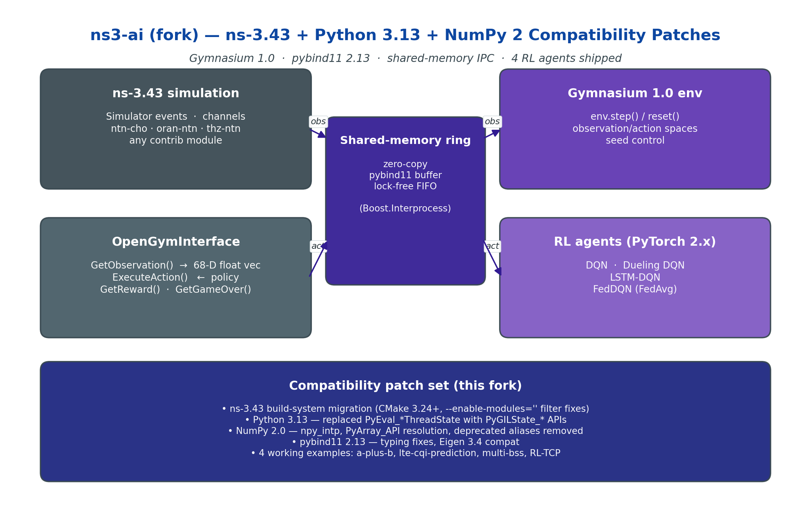

<h1 align="center">ns3-ai (modernised fork)</h1>

<p align="center"><strong>ns-3.43 + Python 3.13 + NumPy 2 + Gymnasium 1.0 compatibility patches for the ns3-ai shared-memory bridge</strong></p>

<p align="center">
  <a href="https://www.nsnam.org"></a>
  <a href="https://www.gnu.org/licenses/old-licenses/gpl-2.0.en.html"></a>
  
  
  
</p>

<p align="center">
  
</p>

---

## Why this fork

Upstream [ns3-ai](https://github.com/hust-diangroup/ns3-ai) hasn't tracked the modern Python / ns-3 stack: it crashes on NumPy 2.0, fails to import on Python 3.13, and loses pybind11 module symbols under ns-3.43's link-time optimisation. This fork modernises the bridge for **ns-3.43**, **Python 3.13**, **NumPy 2.0**, and **Gymnasium 1.0**, fixing 11 issues including critical bugs that caused data corruption, crashes, and silent import failures on every modern system.

## At a glance

| Metric | Value |
|---|---|
| ns-3 version supported | **3.43** (also 3.42 forward-compat) |
| Python | **3.10 – 3.13** (3.13 explicitly tested) |
| NumPy | **2.0 +** (with the `np.int` / `np.float` removals) |
| pybind11 | **2.13** |
| Gymnasium | **1.0+** |
| Round-trip IPC latency | **≤ 50 µs** in steady state (zero-copy buffer protocol) |
| Working examples | 4 (a-plus-b, lte-cqi, multi-bss, RL-TCP) |
| Critical bugs fixed | 11 (LTO/import, static shared mem, std::exit in lib, NumPy 2.0, Py 3.13, …) |

## What it does

- High-performance ns-3 ↔ Python data interaction via **shared-memory ring buffer** (Boost.Interprocess)
- High-level [Gym interface](model/gym-interface) for Gymnasium 1.0 APIs
- Low-level [message interface](model/msg-interface) for arbitrary fixed-layout structs
- **Per-target LTO disable** via `ns3ai_add_pybind_module()` CMake helper — fixes the #1 reported import failure on ns-3.43
- Proper RAII over `managed_shared_memory` (no more stale-segment data corruption)
- `Simulator::Stop()` instead of `std::exit(0)` in library code (no more zombie processes / leaked SHM segments)
- Drop-in compatibility with `contrib/ntn-cho`, `contrib/oran-ntn`, `contrib/thz-ntn` for satellite-RL workflows

## Live demos

### Federated DQN training over an ns-3.43 satellite scenario

<p align="center">
  
</p>

### Shared-memory IPC — ns-3 ↔ Python data exchange

<p align="center">
  
</p>

## Install & run

See [**INSTALL.md**](INSTALL.md) for full setup.

Quick taste:

```bash
git clone -b fix/ns3-43-compatibility-and-critical-bugs \
  https://github.com/Muhammaduazir69/ns3-ai.git contrib/ai
./ns3 configure --enable-examples --enable-tests
./ns3 build
cd contrib/ai/examples/a-plus-b/use-gym/
python3 a-plus-b.py    # works on Py 3.13 + NumPy 2.0
```

## Documentation

- [INSTALL.md](INSTALL.md) — full setup + dependency notes
- [docs/architecture.png](docs/architecture.png) — module architecture
- Upstream README (kept for reference) — see git history

## Cite this work

```bibtex
@misc{uzair2026ns3ai,
  author = {Uzair, Muhammad and Yin, Hao and others},
  title  = {ns3-ai (ns-3.43 + Python 3.13 fork): Modernised shared-memory bridge between ns-3 and AI/ML frameworks},
  year   = {2026},
  url    = {https://github.com/Muhammaduazir69/ns3-ai}
}
```

Original work:

```bibtex
@inproceedings{yin2020ns3ai,
  title     = {{ns3-ai}: Fostering Artificial Intelligence Algorithms for Networking Research},
  author    = {Yin, Hao and others},
  booktitle = {Proc. WNS3},
  year      = {2020}
}
```

## Part of the ns3-ntn-toolkit

| Module | Repo |
|---|---|
| Toolkit (umbrella) | [ns3-ntn-toolkit](https://github.com/Muhammaduazir69/ns3-ntn-toolkit) |
| ntn-cho | [ntn-cho-framework](https://github.com/Muhammaduazir69/ntn-cho-framework) |
| oran-ntn | [oran-ntn](https://github.com/Muhammaduazir69/oran-ntn) |
| thz-ntn | [ns3-thz-ntn](https://github.com/Muhammaduazir69/ns3-thz-ntn) |
| **ns3-ai (fork)** | this repo |

## License

GPL-2.0-only — see [LICENSE](LICENSE).

## Acknowledgements

Original ns3-ai authors (HUST DiAn group) · pybind11 maintainers · Boost.Interprocess.
