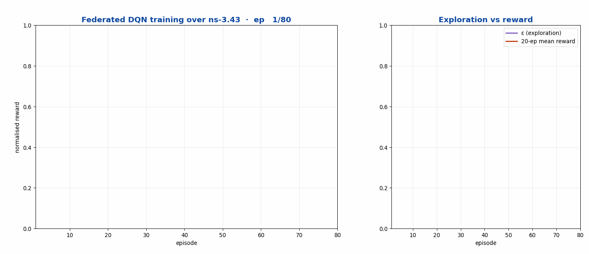
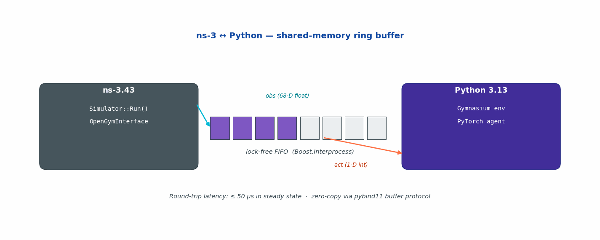

<h1 align="center">ns3-ai-ntn</h1>

<p align="center"><strong>Gymnasium 1.0 environments for NTN radio resource management, over a versioned shared-memory bridge</strong></p>

<p align="center">
  <a href="https://www.nsnam.org"></a>
  <a href="https://www.gnu.org/licenses/old-licenses/gpl-2.0.en.html"></a>
  
  
  
</p>

<p align="center">
  <a href="https://github.com/Muhammaduazir69/ns3-ntn-toolkit">Toolkit</a>
  &nbsp;·&nbsp;
  <a href="INSTALL.md">Install</a>
  &nbsp;·&nbsp;
  <a href="#examples">Examples</a>
  &nbsp;·&nbsp;
  <a href="https://muhammaduazir69.github.io/ns3-ntn-toolkit/modules/ns3-ai-ntn/">Docs</a>
</p>

---

Reinforcement learning against a network simulator fails in two characteristic ways, and this fork addresses both. The first is that the agent is never actually stepped: registering a Gymnasium interface and never calling `Notify()` gives you a training loop that runs, converges, and learned nothing, because there was no `Notify()` call site anywhere in the tree. The second is that the reward is computed from state the action has not reached yet, which inverts it. Measured on the original code, a 5 to 15 dB improvement earned -15 while a 15 to 5 dB degradation earned -5, so the agent was paid ten units more to make the link worse.

Both are fixed, and the fix for the second is structural: the transition is latched inside `GetObservation` rather than left to a post-action hook nobody called.

The C++ and Python sides share a protobuf schema across shared memory, which is a contract that used to be unchecked. The handshake now carries a protocol version, a module version and an FNV-1a schema digest, so a mismatch is reported instead of misread as data.

The bundled trainers are single-agent PPO and SAC over N independent environment copies, not MAPPO or MASAC: there is no centralized critic and no joint observation, and the agents cannot see or affect each other.

## Quick start

Inside the toolkit, where the module is already present and built:

```bash
cd contrib/ns3-ai-ntn/examples/a-plus-b/use-gym/ && python3 a-plus-b.py
./ns3 run "oran-ntn-gym-handover-example --gym=1"
```

Standalone, into an existing ns-3.43 tree:

```bash
git clone -b fix/ns3-43-compatibility-and-critical-bugs https://github.com/Muhammaduazir69/ns3-ai.git contrib/ns3-ai-ntn
./ns3 configure --enable-modules='' --enable-examples --enable-tests
./ns3 build
```

`INSTALL.md` in this directory carries the full dependency list. Most examples in
this module build on `ntn-traffic`, the toolkit's real-stack spine, so the
toolkit tree is the path of least resistance.

## Why this fork

Upstream [ns3-ai](https://github.com/hust-diangroup/ns3-ai) hasn't tracked the modern Python / ns-3 stack: it crashes on NumPy 2.0, fails to import on Python 3.13, and loses pybind11 module symbols under ns-3.43's link-time optimisation. This fork modernises the bridge for **ns-3.43**, **Python 3.13**, **NumPy 2.0**, and **Gymnasium 1.0**, fixing 11 issues including critical bugs that caused data corruption, crashes, and silent import failures on every modern system. On top of that it adds NTN-specific RL tooling (`python_utils/ns3_ai_ntn`) and an AI-RAN inference contract (`grpc/`).

## At a glance

| Metric | Value |
|---|---|
| ns-3 version supported | **3.43** (also 3.42 forward-compat) |
| Python | **3.10 – 3.13** (3.13 explicitly tested) |
| NumPy | **2.0 +** (with the `np.int` / `np.float` removals) |
| pybind11 | **2.13** |
| Gymnasium | **1.0+** |
| Round-trip IPC latency | **≤ 50 µs** in steady state (zero-copy buffer protocol) |
| Working examples | 5 (a-plus-b, lte-cqi, multi-bss, rate-control, RL-TCP) |
| NTN Gymnasium environments | 4 (`HandoverEnv`, `BeamMgmtEnv`, `SliceEnv`, `PowerCtrlEnv`) |
| Critical bugs fixed | 11 (LTO/import, static shared mem, std::exit in lib, NumPy 2.0, Py 3.13, …) |

## What it does

- High-performance ns-3 ↔ Python data interaction via **shared-memory ring buffer** (Boost.Interprocess)
- High-level [Gym interface](model/gym-interface) for Gymnasium 1.0 APIs
- Low-level [message interface](model/msg-interface) for arbitrary fixed-layout structs
- **AI-RAN inference contract** (`grpc/`): `AiranInferenceClient` / `AiranInferenceServer` exchange length-prefixed protobuf (`grpc/proto/airan_inference.proto`) over a pluggable `InferenceChannel` — an in-process FIFO and a length-prefixed TCP transport that mirrors the wire format a grpc++ server would expose from the same `.proto` (a native grpc++ transport is planned). Ships a Triton `config.pbtxt` parser plus two model-repository skeletons (`beam_index_classifier`, `precoder_csi_to_weights`) and deterministic mock runtimes (`AiranMockRuntime`) for testing
- **NTN RL extensions** ([python_utils/](python_utils)): the `ns3_ai_ntn` Python package with 4 Gymnasium environments (`HandoverEnv`, `BeamMgmtEnv`, `SliceEnv`, `PowerCtrlEnv`) — **synthetic placeholders that do not boot ns-3** (no measured KPI; see `ns3gym_compat.py`) — plus Stable-Baselines3 PPO training, PyTorch Geometric GAT models for constellation-graph learning, MAPPO / MASAC multi-agent baselines, and an `ns3gym` compatibility shim. These exercise the RL tooling; they are not yet driven by a live ns-3 NTN data plane
- **Per-target LTO disable** via `ns3ai_add_pybind_module()` CMake helper — fixes the #1 reported import failure on ns-3.43
- Proper RAII over `managed_shared_memory` (no more stale-segment data corruption)
- `Simulator::Stop()` instead of `std::exit(0)` in library code (no more zombie processes / leaked SHM segments)
- Builds alongside `contrib/ntn-cho`, `contrib/oran-ntn`, `contrib/thz-ntn` and exposes the bridge API those modules can call — but no satellite-RL workflow is wired through it yet (integration is future work, not a shipped data path)

## Demos

> Scope note: the ns3-ai bridge below is the genuine upstream shared-memory
> bridge, but it is **not currently wired to any NTN satellite scenario** in
> this toolkit. The NTN Gymnasium environments shipped in
> `python_utils/ns3_ai_ntn` are **synthetic placeholders** (they do not boot
> ns-3 — see `ns3gym_compat.py`), and the "DQN" they train is the upstream
> RL example, not a satellite RAN agent. The clip below shows the RL training
> loop over the synthetic env, not a live federated DQN over an ns-3 LEO sim.

### RL training loop (synthetic NTN env + upstream ns3-ai bridge)

<p align="center">
  
</p>

### Shared-memory IPC — ns-3 ↔ Python data exchange

<p align="center">
  
</p>

## Install & run

The module ships in `contrib/ns3-ai-ntn` as part of the
[ns3-ntn-toolkit](https://github.com/Muhammaduazir69/ns3-ntn-toolkit). It needs
**Boost ≥ 1.70** (interprocess + program_options), **pybind11** (CMake config
package), and **protobuf** — see [INSTALL.md](INSTALL.md) for full setup.
Dropping a `libtensorflow` or `libtorch` distribution into `model/` enables the
optional pure-C++ ML examples; otherwise they are skipped automatically at
configure time.

Quick taste:

```bash
# from the ns-3-dev root
./ns3 configure --enable-examples --enable-tests
./ns3 build

# hello-world: C++ side passes numbers to Python over shared memory
./ns3 build ns3ai_apb_gym
cd contrib/ns3-ai-ntn/examples/a-plus-b/use-gym/
python3 apb.py    # works on Py 3.13 + NumPy 2.0
```

## Examples

Each example directory has its own README with full run instructions. The
Python script drives the simulation: it spawns the matching ns-3 binary itself.

| Example | CMake targets | What it shows |
|---|---|---|
| [a-plus-b](examples/a-plus-b) | `ns3ai_apb_gym`, `ns3ai_apb_msg_stru`, `ns3ai_apb_msg_vec` | Hello-world for both interfaces: C++ sends numbers, Python returns the sum |
| [rl-tcp](examples/rl-tcp) | `ns3ai_rltcp_gym`, `ns3ai_rltcp_msg`, `ns3ai_rltcp_purecpp` | DQN congestion control over the Gym or message interface |
| [rate-control](examples/rate-control) | `ns3ai_ratecontrol_constant`, `ns3ai_ratecontrol_ts` | Wi-Fi rate control (constant / Thompson sampling) via the message interface |
| [lte-cqi](examples/lte-cqi) | `ns3ai_ltecqi_msg`, `ns3ai_ltecqi_purecpp` | Online LSTM CQI prediction in an LTE scheduler |
| [multi-bss](examples/multi-bss) | `ns3ai_multibss` | Multi-BSS Wi-Fi channel-access optimisation with a bundled VR traffic app |

## Tests

```bash
# C++ AI-RAN inference contract (9 cases: codec round-trips, in-proc/TCP
# channels, Triton config parsing, failure modes, in-simulator workload)
./test.py -s oran-ntn-airan-inference

# Python NTN RL extensions
cd contrib/ns3-ai-ntn/python_utils
pip install -e .[test] && pytest tests/ -v
```

## Documentation

- [INSTALL.md](INSTALL.md) — full setup + dependency notes
- [docs/architecture.png](docs/architecture.png) — module architecture
- [model/gym-interface/README.md](model/gym-interface) and [model/msg-interface/README.md](model/msg-interface) — interface guides
- [python_utils/README.md](python_utils/README.md) — NTN RL extensions (envs, SB3, GNN, MARL)
- [docs/using-pure-cpp.md](docs/using-pure-cpp.md) — pure-C++ inference with libtensorflow / libtorch
- Upstream README (kept for reference) — see git history

## Cite this work

```bibtex
@misc{uzair2026ns3ai,
  author = {Uzair, Muhammad and Yin, Hao and others},
  title  = {ns3-ai (ns-3.43 + Python 3.13 fork): Modernised shared-memory bridge between ns-3 and AI/ML frameworks},
  year   = {2026},
  url    = {https://github.com/Muhammaduazir69/ns3-ai}
}
```

Original work:

```bibtex
@inproceedings{yin2020ns3ai,
  title     = {{ns3-ai}: Fostering Artificial Intelligence Algorithms for Networking Research},
  author    = {Yin, Hao and others},
  booktitle = {Proc. WNS3},
  year      = {2020}
}
```

## Part of the ns3-ntn-toolkit

| Module | Repo |
|---|---|
| Toolkit (umbrella) | [ns3-ntn-toolkit](https://github.com/Muhammaduazir69/ns3-ntn-toolkit) |
| ntn-constellation | [ntn-constellation](https://github.com/Muhammaduazir69/ntn-constellation) |
| ntn-rrc | [ntn-rrc](https://github.com/Muhammaduazir69/ntn-rrc) |
| ntn-observability | [ntn-observability](https://github.com/Muhammaduazir69/ntn-observability) |
| **ns3-ai-ntn (this fork)** | this repo |
| ntn-sagin | [ntn-sagin](https://github.com/Muhammaduazir69/ntn-sagin) |
| ntn-slice | [ntn-slice](https://github.com/Muhammaduazir69/ntn-slice) |
| ntn-v2x | [ntn-v2x](https://github.com/Muhammaduazir69/ntn-v2x) |
| ntn-traffic | [ntn-traffic](https://github.com/Muhammaduazir69/ns3-ntn-toolkit/tree/main/ns-3-dev/contrib/ntn-traffic) |
| ntn-sionna | [ntn-sionna](https://github.com/Muhammaduazir69/ntn-sionna) |
| ntn-digital-twin | [ntn-digital-twin](https://github.com/Muhammaduazir69/ntn-digital-twin) |
| ntn-cho | [ntn-cho-framework](https://github.com/Muhammaduazir69/ntn-cho-framework) |
| oran-ntn | [oran-ntn](https://github.com/Muhammaduazir69/oran-ntn) |
| thz-ntn | [ns3-thz-ntn](https://github.com/Muhammaduazir69/ns3-thz-ntn) |

---

## Standards implemented

Gymnasium 1.0 environment API. 3GPP TS 28.552 for the measurements the observation space is built from, TS 38.331 for the handover action space, TR 38.821 for the NTN geometry the environments run over. Note that 3GPP TR 38.843 AI/ML lifecycle management is not implemented.

## Keywords

reinforcement learning, deep reinforcement learning, Gymnasium, ns3-ai, ns3-gym, shared memory bridge, PPO, SAC, radio resource management, handover selection, beam management, slice admission, power control, reward shaping, AI-native RAN, machine learning for networks, satellite RRM, non-terrestrial network, ns-3.

## Author

**Muhammad Uzair**, Independent Researcher
[ORCID 0009-0002-4104-2680](https://orcid.org/0009-0002-4104-2680)

Part of the [ns3-ntn-toolkit](https://github.com/Muhammaduazir69/ns3-ntn-toolkit),
a pre-integrated ns-3.43 platform for 6G non-terrestrial network research.
Mirrored on [GitLab](https://gitlab.com/ns3-ntn-toolkit).

## License

GPL-2.0-only, matching ns-3.
