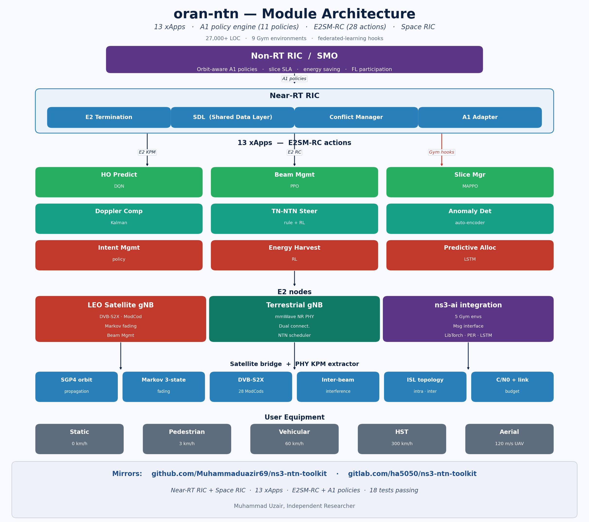

# oran-ntn

> O-RAN over Non-Terrestrial Networks: a Near-RT RIC, an on-board Space-RIC, E2/canonical-KPM telemetry, A1 policy, xApps, and conflict management for ns-3.43.
> Part of **ns3-ntn-toolkit** — [README](../../README.md) / [INSTALL](../../INSTALL.md).

<p align="center">
  
</p>

| | |
|---|---|
| ns-3 version | `release ns-3.43` |
| License | GPL-2.0-only |
| Maintainer | Muhammad Uzair, Independent Researcher (ORCID 0009-0002-4104-2680) |
| Test suite | `oran-ntn` |
| Default scenario | `examples/oran-ntn-full-scenario.cc` |

## Overview

`oran-ntn` brings the O-RAN disaggregated RAN control architecture to
non-terrestrial networks. It models the WG3 **Near-Real-Time RIC** with
xApp lifecycle management, an E2AP-style termination, A1 policy ingest from
a Non-RT RIC, and a multi-xApp **conflict manager**. KPM telemetry is
exported both as a flat record stream and in a **canonical KPM**
encoding (stable measurement IDs / labels). On top of the WG2/WG3 ground
control plane it adds an on-board **Space-RIC** that takes over autonomously
when the satellite loses its feeder link, running local KPM-driven inference
so handover and beam decisions continue through the outage.

The module targets LEO constellations: a satellite bridge supplies orbit
geometry (elevation → slant range → propagation delay), link-budget /
C/N₀, and ISL topology, while xApps cover handover prediction, beam
hopping, slice management, Doppler compensation, and TN-NTN steering. A
second example closes a real data-plane control loop, where an mMIMO
precoder xApp reacts to live E2-KPM SINR and changes the delivered
goodput over a point-to-point satellite downlink.

## What's new in v2

See [`../../CHANGELOG.md`](../../CHANGELOG.md) for the full toolkit changelog.

- **RSRQ is now clamped to the 3GPP range [−19.5, −3] dB** (it was
  previously reaching +17 dB, which is non-physical).
- **`action_log` success now reflects xApp confidence** instead of a
  hardcoded `true`.
- **`latency` / `propagation_delay` now derive from the slant range**
  (elevation → range), per-slice 5QI is mapped correctly
  (eMBB → 9, URLLC → 82, mMTC → 79), `slice_id` is serialized correctly,
  and per-cell PRB usage, active-UE count, and throughput now vary with
  both time and cell.
- **The Space-RIC is now fed live KPM** and the feeder-link outage scales
  to the run length, so on-board autonomous handover decisions are actually
  exercised — `space_ric_metrics.csv` is no longer all-zero on short runs.
- **Note:** an empty `conflict_log.csv` is *correct* for the shipped xApp
  mix. The active xApps contend on disjoint resource keys, so the conflict
  manager has nothing to resolve; the file is written but stays at headers
  only.

## Models, helpers & key classes

Derived from `model/*.h` and `helper/*.h`.

### Near-RT RIC platform
- `OranNtnNearRtRic` (`model/oran-ntn-near-rt-ric.h`) — RIC kernel: xApp
  lifecycle, E2 termination, an `OranNtnSdl` shared-data layer, action
  routing, and metrics aggregation.
- `OranNtnConflictManager` (`model/oran-ntn-conflict-manager.h`) — multi-xApp
  conflict resolution; strategy selectable via `ConflictResolutionStrategy`
  (`PRIORITY_BASED`, `TEMPORAL`, `MERGE`, …). Writes `conflict_log.csv`.

### E2 interface & KPM
- `OranNtnE2Node` / `OranNtnE2Termination` (`model/oran-ntn-e2-interface.h`) —
  E2AP-style subscription / indication path; `OranNtnE2Node` carries the
  feeder-link availability flag that drives Space-RIC autonomy.
- Canonical KPM IDs (`model/oran-ntn-kpm-canonical-ids.h`) — stable
  measurement and label identifiers under `ns3::oranntn::kpm` /
  `ns3::oranntn::label`, used to emit `kpm_canonical.csv`.
- KPM / RC / CCC / ephemeris service models
  (`model/oran-ntn-service-model-*.h`).

### A1 policy
- `OranNtnA1PolicyManager` / `OranNtnA1Adapter`
  (`model/oran-ntn-a1-interface.h`) — A1 policy ingest from the Non-RT RIC;
  orbit-aware constellation policies are generated by the helper.

### Space-RIC (on-board)
- `OranNtnSpaceRic` (`model/oran-ntn-space-ric.h`) — on-board RIC that enters
  autonomous mode on feeder-link outage (`EnterAutonomousMode()` /
  `ExitAutonomousMode()`), consuming local KPM via `ProcessLocalKpm()`.
- `OranNtnSpaceRicInference` (`model/oran-ntn-space-ric-inference.h`) — local
  inference path for KPM-driven decisions while the ground RIC is
  unreachable.
- `OranNtnIslHeader` (`model/oran-ntn-isl-header.h`) — ISL transport header.

### Satellite bridge & PHY
- `OranNtnSatBridge` (`model/oran-ntn-sat-bridge.h`) — orbit geometry,
  link budget / C/N₀, ISL topology, mmWave hooks.
- `OranNtnMmwaveBeamforming`, `OranNtnChannelModel`, `OranNtnNtnScheduler`,
  `OranNtnPhyKpmExtractor`, `OranNtnDualConnectivity`,
  `OranNtnMmimoCodebook`, `OranNtnMmimoPrecoderXapp`.

### xApps
All derive from `OranNtnXappBase` (`model/oran-ntn-xapp-base.h`). The full
scenario starts five simultaneously: HO Predict, Beam Hop, Slice Manager,
Doppler Comp, and TN-NTN Steering (`model/oran-ntn-xapp-*.h`). Additional
advanced xApps (interference mgmt, energy harvest, predictive alloc,
multi-connectivity, ISAC, THz beam/RIS/spectrum) ship in the same directory.

### Helper
- `OranNtnHelper` (`helper/oran-ntn-helper.h`) — one-call construction of the
  Non-RT RIC, Near-RT RIC, satellite/terrestrial E2 nodes, Space-RICs, A1
  policies, and xApps; KPM injection (`InjectKpmReport`); and the CSV writers
  (`WriteAllMetrics`).

## Examples

The two examples build to `build/contrib/oran-ntn/examples/`. Each can be
launched through `./ns3 run` or by the direct binary path
`build/contrib/oran-ntn/examples/ns3.43-<NAME>-default`.

### oran-ntn-full-scenario

End-to-end O-RAN NTN scenario: a LEO Walker constellation (default 6 planes
× 11 sats), 5 terrestrial gNBs, 100 UEs, a Non-RT RIC with orbit-aware A1
policies, a Near-RT RIC running 5 xApps with conflict resolution, on-board
Space-RICs, a scheduled feeder-link outage that triggers autonomous mode,
and a real ns-3 traffic plane that emits the run-health report.

> **Run this example from the ns-3 root** (`ns-3-dev/`) — it performs a
> satellite-data lookup that resolves against the working directory.

```bash
# via ns3 wrapper
./ns3 run "oran-ntn-full-scenario --duration=600 --numUes=100 --outputDir=oran-ntn-output"

# direct binary (run from ns-3-dev/)
./build/contrib/oran-ntn/examples/ns3.43-oran-ntn-full-scenario-default \
    --duration=600 --numUes=100 --outputDir=oran-ntn-output
```

**Outputs:** written to `--outputDir` —
`kpm_dataset.csv`, `kpm_canonical.csv`, `action_log.csv`, `conflict_log.csv`,
`xapp_metrics.csv`, `space_ric_metrics.csv`, `sim_health.csv`.

**Key args** (only those exposed via `cmd.AddValue()`):

| Flag | Default | Meaning |
|------|---------|---------|
| `--duration` | 600 | simulation duration (s) — **not** `--simTime` |
| `--numUes` | 100 | number of UEs |
| `--numPlanes` | 6 | orbital planes |
| `--satsPerPlane` | 11 | satellites per plane |
| `--enableSpaceRic` | true | enable on-board Space-RICs |
| `--outputDir` | `oran-ntn-output` | CSV output directory |

(Additional flags: `--altitude`, `--inclination`, `--numTnGnbs`,
`--kpmInterval`, `--conflictStrategy` {`priority`,`temporal`,`merge`},
`--enableFL`.)

### oran-ntn-ric-controlled-traffic

A closed RIC control loop over a **real data plane**: a LEO satellite
streams UDP downlink to a UE over a point-to-point link with a
geometry-driven error model. An `OranNtnE2Node` reports E2-KPM (SINR) each
period; an mMIMO precoder xApp consumes each indication and, when SINR drops
below threshold, selects a beam from an `OranNtnMmimoCodebook` and applies
its array gain — raising EIRP and recovering goodput during the
low-elevation part of the pass. Compare `--xapp=true` vs `--xapp=false`.

```bash
# via ns3 wrapper
./ns3 run "oran-ntn-ric-controlled-traffic --simSeconds=120 --dataRateMbps=5 --xapp=true"

# direct binary
./build/contrib/oran-ntn/examples/ns3.43-oran-ntn-ric-controlled-traffic-default \
    --simSeconds=120 --dataRateMbps=5 --xapp=true
```

**Outputs:** per-second progress lines and an end-of-run summary printed to
stdout (FlowMonitor PDR, beam activations, average goodput). No CSV files.

**Key args:** `--simSeconds`, `--dataRateMbps`, `--xapp`, `--numTx`,
`--sinrThreshDb`, `--baseEirpDbm`, `--leoAltKm`, `--satSpeed`, `--freqGHz`,
`--packetBytes`, `--linkCapacityMbps`.

## Build, run & test

The module builds with the parent toolkit. To configure and build it on its
own from the ns-3 root:

```bash
cd ns-3-dev
./ns3 configure --enable-tests --enable-examples --build-profile=optimized
./ns3 build oran-ntn -j$(nproc)
```

Run the test suite (either form):

```bash
./ns3 test --suite=oran-ntn
# or, directly:
./build/utils/ns3.43-test-runner-default --suite=oran-ntn
```

For full prerequisites and toolkit-wide setup see [`../../INSTALL.md`](../../INSTALL.md).

## License & author

GPL-2.0-only — see [`LICENSE`](LICENSE).

Muhammad Uzair, Independent Researcher (ORCID
[0009-0002-4104-2680](https://orcid.org/0009-0002-4104-2680)).
